# MySql数据库

## 为什么需要数据库

保存数据，下次访问的时候，数据是最新的数据。

## 数据库原理图

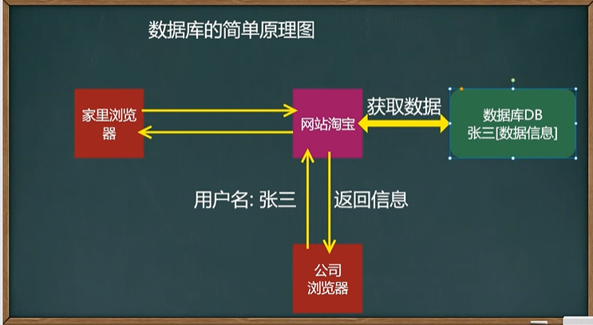

## 安装数据库


```java
//my.ini配置文件
[client]//表示客户端的配置
port=3306//端口是3306
default-character-set=utf8//字符集是utf8
[mysqld]//表示对服务的配置
# 设置为自己MYSQL的安装目录
basedir=D:\mySql\mysql-5.7.19-winx64\
# 设置为MYSQL的数据目录
datadir=D:\mySql\mysql-5.7.19-winx64\data\
port=3306//系统自己去创建
character_set_server=utf8
#跳过安全检查
skip-grant-tables

```


小细节；每次操作完后退回到D盘，不然有时候一些操作会出现正在访问的错误


启动和停止mySql的命令


用户是root

```mysql
net start mysql #启动数据库
net stop mysql #停止数据库
use mysql; #表示使用数据库,注意有一个分号
update user set authentication_string=password('hsp') where user='root' and Host='localhost';#修改root用户的密码为hsp,然后从本地登录
flush privileges;//刷新权限才能生效
```

### 命令行连接Mysql

只要是一个服务往往都会监听一个端口，商品是在my.ini配置文件中指定的


```
grant all privileges on *.* to root@'%' identified by '123456' with grant option;
flush privileges;
设置mysq允许外部访问
```

### 安装使用图形化MySQL管理软件 


### 数据库的三层结构 


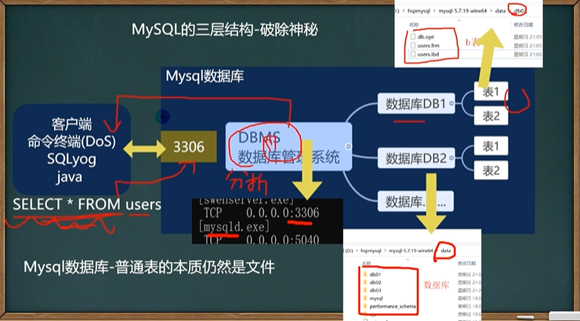

### 体会通过Java操作Mysql


 

## 数据库相关操作

### 创建数据库


默认字符集是utf8,排序规则是不区分大小写


表中如果没有指定字符集和校对规则，就会以数据库的校对规则为准

```mysql
#使用指令创建数据库db02
CREATE DATABASE db02
#删除数据库指令
DROP DATABASE db03
#创建一个使用utf8字符集的db03数据库
CREATE DATABASE db03 CHARACTER SET utf8
#创建一个使用utf8字符集，并带校对规则（区分大小写）的db04数据库
CREATE DATABASE db04 CHARACTER SET utf8 COLLATE utf8_bin

#测试表区分大小写是否是根据数据
SELECT * FROM t1 WHERE name = 'tom';
```

#### 查看、删除数据库

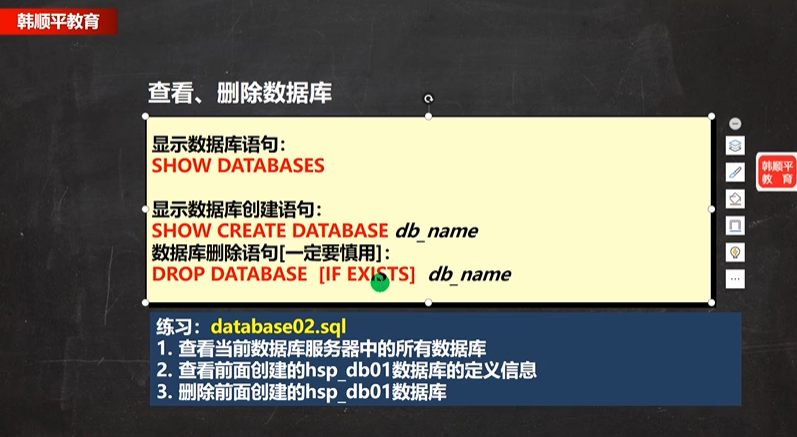

```mysql
#查看当前数据库服务器中的所有数据库
SHOW DATABASES
#查看前面创建的db01数据库的定义信息
SHOW CREATE DATABASE db01
#在创建数据库，表的时候，为了规避关键字，可以使用反引号解决
CREATE DATABASE db01
#删除数据库（一定要慎重，全球追杀）
DROP DATABASE db01


```

#### 备份和恢复数据库


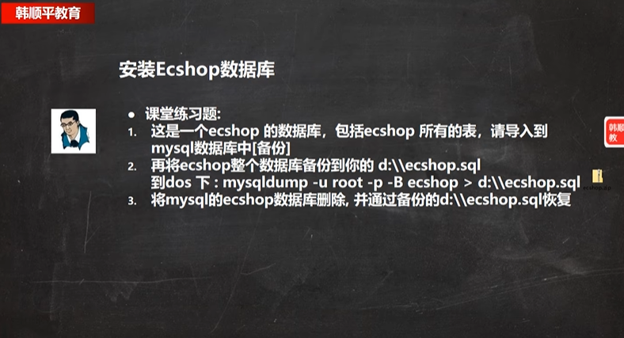

### 表相关操作

#### 创建表

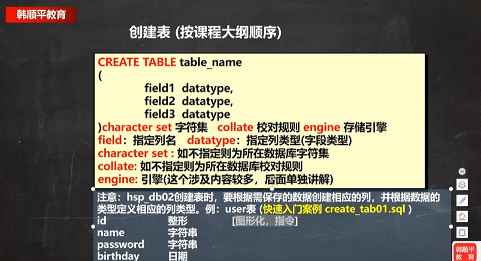


```mysql
CREATE TABLE `user`(
				id int,
				`name` VARCHAR(255),
				`password` VARCHAR(32),
				`birthday` DATE)
				CHARACTER SET utf8  COLLATE utf8_bin;

```

####  创建表练习


```mysql
#创建表的课堂练习
CREATE TABLE emp(
		id INT,
		`name` VARCHAR(32),
		sex CHAR(1),
		birthday DATE,
		entry_date DATETIME,
		job VARCHAR(32),
		salary DOUBLE,
		`resume` TEXT
		)CHARACTER SET utf8 COLLATE utf8_bin ENGINE INNODB

-- 添加一条
INSERT INTO emp VALUES(
		1,"小妖怪",'男','2022-1-1','2022-1-1 10:10:10', 
		'巡山的',3000,'大王叫我来巡山')
		SELECT * FROM emp
```

#### 修改表和删除


```mysql
-- 添加列
ALTER TABLE tablename 
ADD (column datatype [DEFAULT expr]
    [,column datatype]...);
-- 修改列
ALTER TABLE tablename
MODIFY(column datatype [DEFAULT expr]
      [,column datatype]...)
-- 删除列
ALTER TABLE tablename
DROP (column)
-- 查看表结构 
desc 表名；
-- 修改表名
Rename table 表名 to 新表名
-- 修改字符集
alter table 表名 character set 字符集
```

 

```mysql
DESC employee
		
ALTER TABLE emp ADD image VARCHAR(32) NOT NULL DEFAULT '' AFTER RESUME
ALTER TABLE emp MODIFY job VARCHAR(60) NOT NULL DEFAULT ''
ALTER TABLE emp DROP sex
RENAME TABLE emp TO employee
ALTER TABLE employee CHARACTER SET utf8
ALTER TABLE employee CHANGE `name` user_name VARCHAR(60) NOT NULL DEFAULT ''
```


### mysql的列数据类型


参考手册


#### 数值类型


#### 小数类型


这三个小数的精度不一样。 

 
decimal可以存非常非常大的数。

#### 字符串的基本使用


varchar 可存入65535个字节，实际要看它的编码，比如utf8编码，前3个用来记录字节数，然后除3就等于21844 ，如果是unicode编码就是除2

细到极致！如果不看过一周，会全部忘记


是21844，老韩真牛逼


 

```mysql
CREATE TABLE t06(
			num1 FLOAT,
			num2 DOUBLE,
			num3 DECIMAL)
#添加数据 
INSERT INTO t06 VALUES (88.123456789123456789,88.123456789123456789,88.123456789123456789)
SELECT * FROM t06


CREATE TABLE t07(
			`name` CHAR(255))
	
CREATE TABLE t08(
			`name` VARCHAR(21844))

CREATE TABLE t09(
			`name` VARCHAR(32766))CHARACTER SET gbk;
DROP TABLE t09
```

**细节：**

 


char有char的价值。


TEXT这种更得于空间利用

#### 日期类型的基本使用


```mysql
CREATE TABLE t14(
	birthday DATE, -- 生日
	jobtime DATETIME, -- 工作时间，记录年月日时分秒
	login_time TIMESTAMP 
	NOT NULL DEFAULT CURRENT_TIMESTAMP ON UPDATE CURRENT_TIMESTAMP)-- 			  登录时间，如果希望login_time列自动更新
-- 	不能为空，默认是当前时间戳，修改是当前时间戳
INSERT INTO t14 (birthday,jobtime) VALUES('2022-11-11','2022-11-11 10:10:10');
SELECT * FROM t14
```

### CRUD（增删改查）


 

   

**insert细节：**


可以转化的

 
一条insert可以添加多条数据


#### update

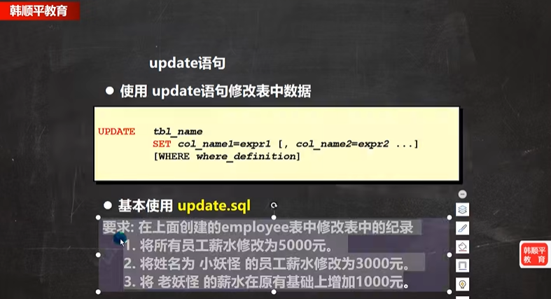


**细节：**


#### delete


**细节：**


#### Select


 

##### 排序


这种起别名更加清晰一点

##### 合计/统计函数-count


##### 合计函数-sum 


##### 合计函数-avg


#####  合计函数-Max/min


#####  分组


​				       

#### 查询加强


如果要判断某个字段是否为空，用is 不能用等号  

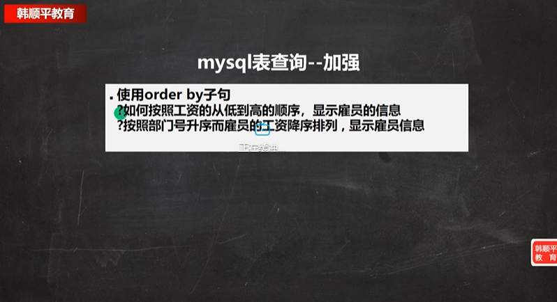


要提前算出来写上，最好不要直接写到参数位置，报错的。


巧妙利用了count（)不统计空的规则 

伴随程序员终生的2个东东：螺旋递升，套娃

尝试写->修改->尝试


注意它们之间的顺序，如果写错了是通不过的。


## 常用函数 

### 字符串常用函数


```mysql
#演示字符串的相关操作
SELECT * FROM emp
SELECT CHARSET(ename) FROM emp
SELECT CONCAT(ename ,"    工作是   ",job) FROM emp
-- dual 亚元表，系统表，可以作为测试表使用
SELECT INSTR('hanshunping','ping') FROM DUAL;
SELECT UCASE(ename) FROM emp
SELECT LCASE(ename) FROM emp
SELECT LEFT(ename,2) FROM emp
SELECT RIGHT(ename,2) FROM emp
SELECT LENGTH('韩顺平')FROM emp
SELECT job  FROM emp
SELECT ename,REPLACE(job,'MANAGER','经理')FROM emp
SELECT STRCMP('hsp','asp')FROM DUAL -- 返回-1，0，1
SELECT SUBSTRING(ename,1,2) FROM emp
SELECT LTRIM("  韩顺平") FROM DUAL
SELECT CONCAT(LCASE(SUBSTRING(ename,1,1)),SUBSTRING(ename,2)) FROM emp
SELECT CONCAT(LCASE(LEFT(ename,1)),RIGHT(ename,LENGTH(ename)-1)) FROM emp
```

### 数学函数


 


### 日期函数


只显示日期不显示时间，用DATE(……)

 
用于一个月、一年以内的订单，


求相差多少天。


求出活了多少天，假如活到80岁还剩多少天。


细节  


当前的一些时间


### 加密函数


  

### 流程控制函数 


## 多表查询

###  多表笛卡尔积 


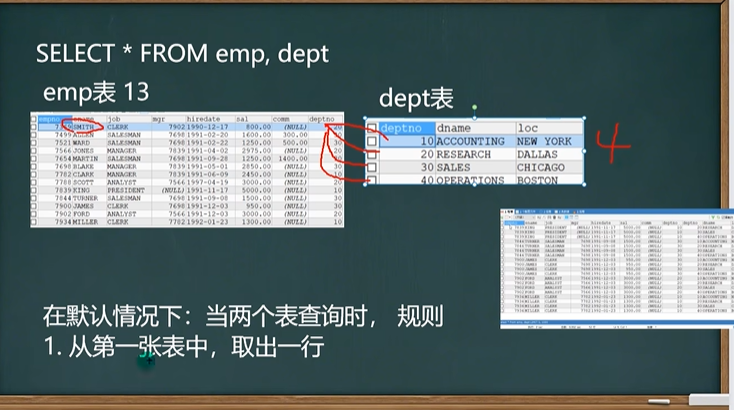
不加条件就是行相乘


查询条件至少不能少于表的个数-1，否则会出现笛卡尔集。比如说3个表查询那至少有2个查询条件


### 自连接


一张表当作两张表来使用


### 子查询 


第7 行这个就是单选子查询


查询和10号部门相同的岗位但是不包括10号部门

### 临时表


### all和any


### 多列子查询 


### 子查询练习


## 表复制和去重


复制表的记录


复制表的结构信息！

distince只是查询的时候暂时去重


## 合并查询 


## 外连接


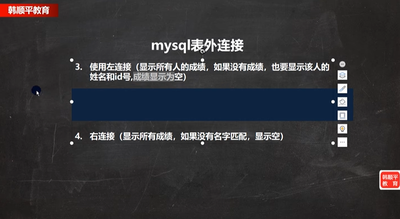


左边这个表如果没有和右边这个表有匹配的，会显示左这个表所有的记录

## sql约束


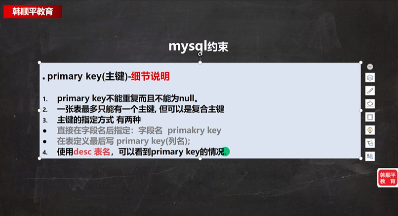

### 主键


### unique


### 外键 


主表必须具有主键约束或是unique约束。


### check


加约束条件，性别是能是男或女，工资必须在1000到2000之间

### 练习


## 自增长


## 索引优化速度


## mysql索引详解


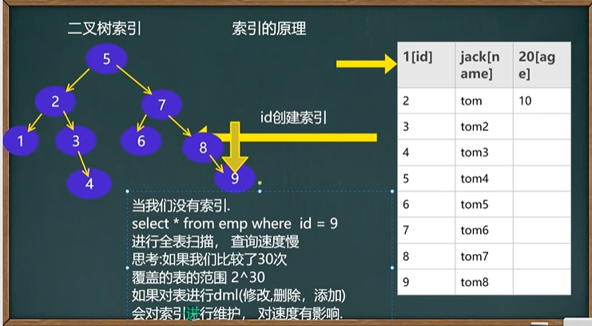


### 添加索引


添加唯一索引，不重复为0，重复为1


添加普通索引的两种方式


添加主键索引

### 删除索引


**修改索引就是先删除在添加**

### 查看索引


### 练习


### 索引规则


## MySql事务


事物需求的引出


```mysql
CREATE TABLE t26(
				id INT,
				`name` VARCHAR(255)
)

INSERT INTO t26 VALUES(100,'tom')
SELECT * FROM t26
INSERT INTO t26 VALUES(200,'jack')
DELETE FROM t26 WHERE id=200

START TRANSACTION
SAVEPOINT a
INSERT INTO t26 VALUES(200,'jack')
SAVEPOINT b
ROLLBACK TO a
```


c1去连接数据库后做了一系列的操作，如果不提交，c2是有一些操作看不到的，这涉及到了隔离级别的问题


需要innodb的存储引擎才可以使用


set autocommit=off也可开启事务

## 事务的隔离级别

隔离级别是和事务相关的，离开事务就不要谈隔离级别


四种隔离级别
Mysql隔离级别定义了**事务与事务之间的隔离程度**
加锁：表正在被另一个事物操作的时候，就不会去操作了。这个就叫加锁

### 隔离级别演示


执行SELECT @@tx_isolation; 可以查看当前的隔离级别。当前这个隔离级别是“可重复读的”（默认)


隔离级别设置成Read Uncommitted


启动事务


加锁后就会卡住，等好边提交完才会继续向下执行


也可以在配置文件中设置默认的隔离级别


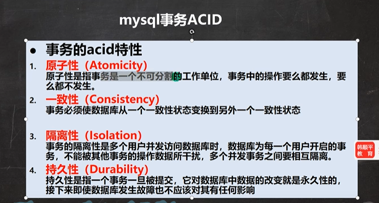


原子性：像这里要么都成功，要么都失败！

### 练习


## 存储引擎


## 视图


## mysql用户管理


### 设置权限 


### Mysql作业练习


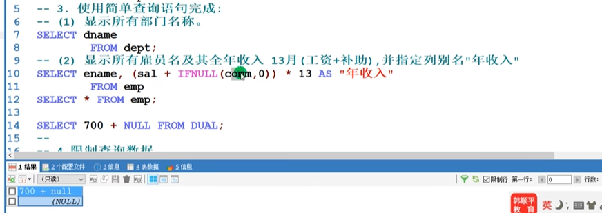


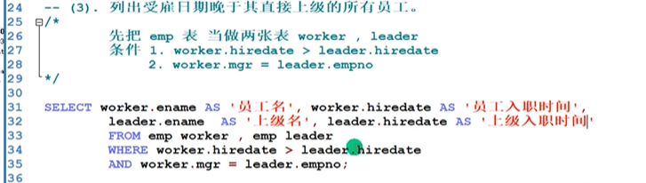


技术就是窗户纸，捅破了往里看发现什么都没有，捅不破就觉得它很神秘


