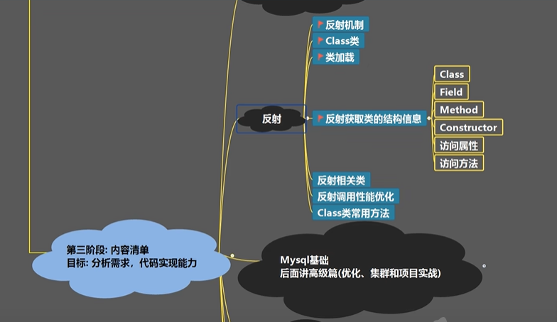
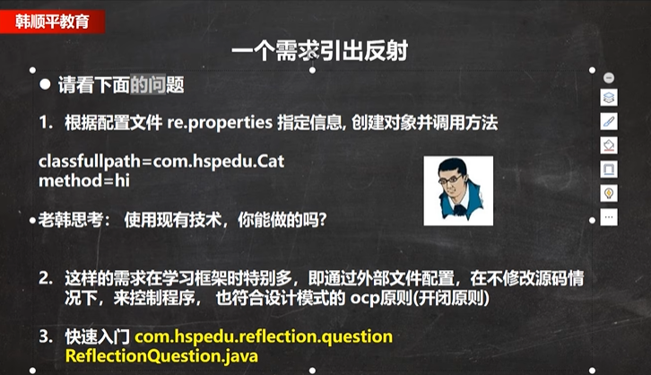

## 接口

default

```java
/**
 * @author 王俊彪
 * @version 1.0
 */
public class Ceshi implements A{
    @Override
    public void hello() {

    }


    public static void main(String[] args) {
        System.out.println(Ceshi.a);//10
        A.ABC();//ABC
//        A.hi();//出错
    }
}
interface A{
    int a=10;
    public void hello();
    //在jdk8及以后可以有用默认实现方法，但需要用default 修饰。但是我不会用，老韩也没有讲，只不过是能用
    public default void hi(){
        System.out.println("hi~");
    };
    //在jdk8后 ，可以用静态方法。
    public static void ABC(){
        System.out.println("ABC");
    }
}

```

## 反射


反射机制涉及框架基本原理，底层


为什么要有反射？