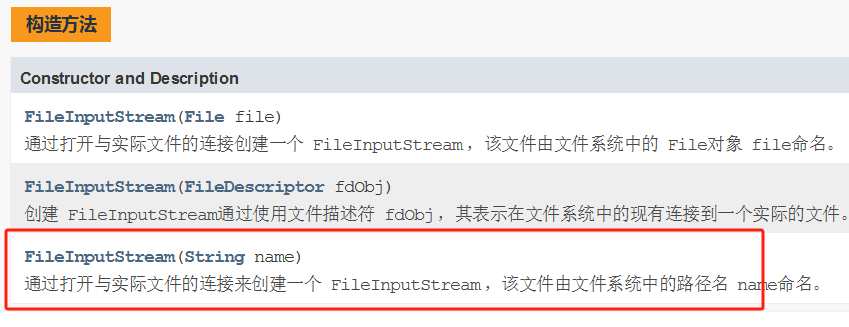
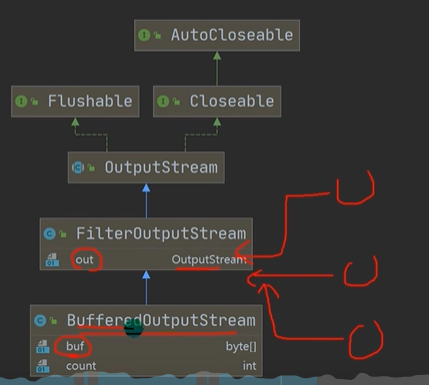
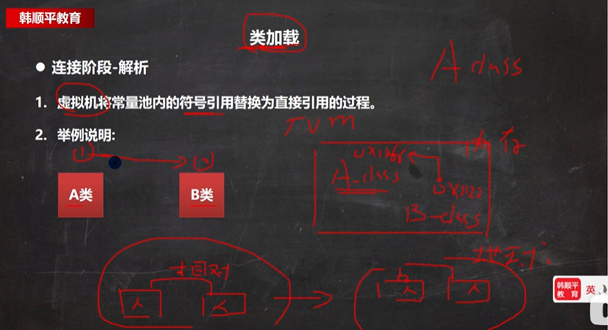
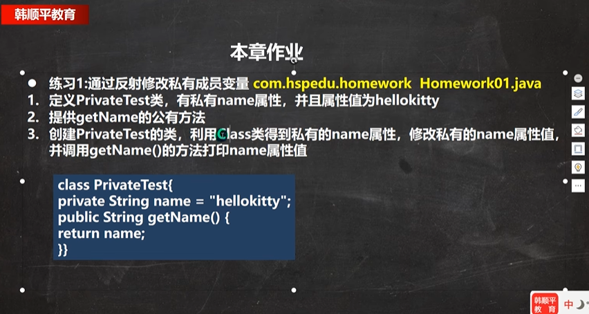

# 笔记

多积累，多思考 ，培养建立编程思想
听懂了以后，对于应用场景还是比较模糊的，只有多去听，多去练习，把java 语言与业务逻辑关联起来。 听懂的只是它的原理和语法，你要去认识它的应用场景，到底体现在什么地方

## 静态属性什么时候加载？ 

## 集合的三种遍历方法？

类的五大成员是哪些？（属性、方法、构造器、代码块、内部类）

## **类变量访问范围**？

## **静态代码块**？

## final关键字

## 泛型？

## 接口

### 接口的注意事项和细节

1. 接口中的属性，只能是final的，而且是 public static final 修饰符。
   比如：int a =1; 实际上是 public static final int a = 1;（必须初始化，也就是说在接口中定义的时候必须赋值）
2. 接口中属性的访问形式：接口名.属性名。
3. 接口的修饰符，只能是public 和默认，这点和类的修饰符是一样的。

其他注意事项

1. 接口不能被实例化
2. 一个类可以实现多个接口
3. 一个普通类实现接口，就必须将该接口的所有方法都实现
4. 抽象类实现接口，可以不用实现接口的方法
5. 接口不能继承其它的类，但是可以继承多个别的接口
6. 接口中所有的方法是 public 方法，接口中抽象方法，可以不用abstract 修饰
   例如：void  aaa();  实际上是 abstract void aaa()
7. 指代原因不明确错误问题：访问接口的 x 就使用 A.x。/访问父类的 x 就使用 super.x 

### 基本介绍

接口就是给出一些没有实现的方法，封闭到一起。到某个类要使用的时候，在根据具体情况把这些方法写出来。

语法：

```java
interface 接口名{
    //属性
    //抽象方法
}

class 类名 implements 接口{
    //自己属性
    //自己方法
    //必须实现的接口的抽象方法
}
```

小结：

1. 接口就是更加抽象的抽象类，抽象类里的方法可以有方法体，接口里所有方法都没有方法体【jdk 7.0】。
   jdk8.0即jdk8.0后接口类可以有静态方法(static)，默认方法(default)，也就是说接口中可以有方法的具体实现
2. 接口体现了程序设计的多态和**高内聚低偶合**的设计思想。
3. 如果子类需要扩展功能时，可以通过实现接口的方式扩展
   可以理解 实现接口 是对 java 单继承机制的一种补充。
4. 继承的价值主要在于：解决代码的**复用性和可维护性**
   接口的价值主要在于：**设计**，设计好各种规范（方法），让其他类去实现这些方法。更加灵活...
5. 继承是满足 is-a的关系，而接口只需要满足like-a的关系
6. 接口在一定程序**上实现代码解耦**（**接口规范性+动态绑定机制**）
7. 接口的多态传递现象

接口的使用：

## 动态绑定？继承？多态？

绑定运行类型

接口的多态？

## 内部类

内部类**最大的特点就是可以直接访问私有属性**，并且可以体现类与类之间的包含关系。
内部类是学习的难点，同时也是重点，后面看底层源码时，有大量的内部类

定义在类的局部位置：（方法中/代码块）

- 局部内部类
- **匿名内部类**

定义在类的成员位置：

- 成员内部类
- 静态内部类

### 1、局部内部类

​	语法：
​		

```java
class Outer {  // 外部类
	public void m1(){//方法
        class Innner{ //局部内部类

        }
    }
}
class Outher1{//外部其他类

}
```

​		注意事项：

- 局部内部类地位是一个局部变量。（可以直接访问外部类的所有成员，包含私有的，不能添加访问修饰符，但可以使用final修饰，因为局部变量也可以使用final,作用域：仅是在定义它的方法或代码块中）

- 访问：

  局部内部类--访问-->外部类的成员（直接访问）
  外部类--访问-->局部内部类的成员
  （创建对象，再访问，注意外部类的定义域：仅仅在定义它的方法或代码块中）
  外部其他类--不能访问-->局部内部类（因为局部变量也不能访问是吧）

- 重名：
  就近原则 
  想访问外部类的成员，使用（外部类名.this.成员）
  外部类名.this 就是调用 这个成员的 对象（外部类的他自己去访问成员当然就是外部类的属性，这是理所当然的事情）

### 2、匿名内部类（重要）

- 匿名内部类同时还是一个对象（因为你在使用的时候肯定会new 嘛）。
- 匿名内部类的类名是被隐藏起来的。

​	语法：

```java
new  类或接口(参数列表){
    类体
}；
```

#### a、基于接口的匿名内部类：

```java
IA tiger =  new Tiger();//传统写法
//IA是一个接口，Tiger 是一个实现了IA接口的类。接口类型可以指向实现了该接口的类的对象实例
tiger.try();
//需求：Tiger 只用一次，就定义一个类，有点浪费。是吧。定义太多类，也太烦了吧，所以就用匿名内部类简化开发
IA tiger = new IA(){
    @Override
    public void cry(){
        System.out.println("老虎叫唤");
    }
}
tiger.try();//现在效果就是一样的


//匿名内部类的特点： 
//		tiger的编译类型？ 看等号左边，IA
//		tiger的运行类型？ 看等号右边，
//		是一个接口呀？	不，是一个匿名内部类。 底层自动分配一个 XXXX的类名。
				     

```

```java
//底层
class XXXX implements IA{
	自己重写的东西就是那个cry()
}。
```

#### b、基于类的匿名内部类

```java
A a = new A(参数列表/无);//传统写法
A a = new A(参数列表/无){//基于类的匿名内部类
   // 自己重写的方法，当然你也可以不写，又不是抽象类/接口
};
//匿名内部类的特点：
//a 的编译类型 看等号左边 A
//a 的运行类型 看等号右边 自动分配的 XXXX
```

```java
//底层
//和基于接口的匿名内部类一个德性
class XXXX extend A{
   //自己重写的方法，当然你也可以不写，又不是抽象类/接口
}
```

XXXX 底部自动分配的类名其实是 （外部类名+$ +数字从1开始，例如Outer$1，不相信可以用 tiger.**getClass**看一下它的类型是不是输出自动分配的那个）

​		注意事项：（**把下面的局部内部类换成匿名内部类即可**）

- 局部内部类地位是一个局部变量。（可以直接访问外部类的所有成员，包含私有的，不能添加访问修饰符，但可以使用final修饰，因为局部变量也可以使用final,作用域：仅是在定义它的方法或代码块中）

- 访问：

  局部内部类--访问-->外部类的成员（直接访问）
  ~~外部类--访问-->局部内部类的成员（这条没有）~~
  ~~（创建对象，再访问，注意外部类的定义域）~~
  外部其他类--不能访问-->局部内部类（因为局部变量也不能访问是吧）

- 重名：
  就近原则 
  想访问外部类的成员，使用（外部类名.this.成员）

​		其他注意事项:

- 可以直接当做一个对象来使用，直接调用方法

  ```java
  /**
   * @author 王俊彪
   * @version 1.0
   * 举一反三，基于接口，类，抽象类都可以这样使用
   */
  public class Ceshi{
      public static void main(String[] args) {
          new A(){
              @Override
              public void say() {
                  System.out.println("您好");
              }
          }.say();
      }
  }
  interface A{
      public void say();
  }
  ```

#### c、基于抽象类的匿名内部类

​	可以略过了，你应该可以想象到它和基于类的有什么区别（就是必须要重写方法）

#### 匿名内部类的实践

当做实参直接传递，简洁高效！！！

1、


这样属于**硬编码**，如果多次使用还好，但是如果写了的话，其他地方也就都改了，所以不推荐！！！

使用了匿名内部类后更加灵活了。传统方法呢就更统一一些
//举例的f1 是一个静态方法，并将传进去的接口/类，运行show方法

2、


```java
/**
 * @author 王俊彪
 * @version 1.0
 * 和老韩想的有点不一样，我是用了构造器了，得到教训，能用方法，尽量用方法，不用构造器。"学一手"
 */
public class Ceshi{
    public static void main(String[] args) {
        Cellphone cellphone = new Cellphone();
        cellphone.alarmClock(new Bell() {
            @Override
            public void ring() {
                System.out.println("懒猪起床了");
            }
        });
        cellphone.alarmClock(new Bell() {
            @Override
            public void ring() {
                System.out.println("小伙伴们上课了");
            }
        });
    }
}
interface Bell{
    public void ring();
}
class Cellphone {
    //闹钟功能
    public void alarmClock(Bell bell){//虽然运行类型是bell，但编译类型是一直变化的。
       System.out.println(bell.getClass());
        bell.ring();//实现了动态绑定 
    }
}
```

### 3、成员内部类

语法：

```java
class outer{//外部类
	class Inter{//成员内部类
        
    }
}
```

 注意事项：

- 成员内部类地位是一个成员。（可以直接访问外部类的所有成员，包含私有的，可以添加任意访问修饰符（public、protected、默认、private）,因为地位是一个成员嘛，作用域：和外部类的其他成员一样，为整个类体）

- 访问：

  成员内部类--访问-->外部类的成员（直接访问）
  外部类--访问-->成员内部类的成员
  （创建对象，再访问）
  外部其他类--访问-->成员内部类（不同于上面两种，这里是可以访问的，而且还有三种访问方式，如下：）

  ```java
  //第一种方式：(一个新奇的语法，"学一手")
  Outer outer = new Outer();
  Outer.Inter inter = outer.new Inter();//相当于把后成的new Inter() 当做outer的成员，注意outer 是小写的对象名
  ```

  ```java
  //第二种方式，返回一个成员内部类的对象
  Outer outer = new Outer();
  Outer.Inter inter = outer.getInter()；//就是把第一种方式的new Inter换成了getInter()
  ```

  ```java
  //第三种方式,其实就是把前面两种合起来,简洁一点
   Outer.Inter inter = new Outer().new Inter();
  ```

- 重名：
  就近原则 
  想访问外部类的成员，使用（外部类名.this. ）
  外部类名.this 就是调用 这个成员的 对象（外部类的他自己去访问成员当然就是外部类的属性，这是理所当然的事情）

### 4、静态内部类

语法：

```java
class outer{//外部类
	static class Inter{//静态内部类
        
    }
}
```

注意事项：（**静态方法只能访问静态成员，当然静态类也只能访问静态成员**）

- ~~成员~~   静态内部类地位是一个成员。（可以直接访问外部类的所有成员，包含私有的，可以添加任意访问修饰符（public、protected、默认、private）,因为地位是一个成员嘛，（**但不能直接访问非静态成员**），作用域：和外部类的其他成员一样，为整个类体）

- 访问：

   静态内部类--访问-->外部类的成员（直接访问（**静态成员**））
  外部类--访问-->静态内部类的成员
  （创建对象，再访问）
  外部其他类--访问-->静态内部类（ 有三种访问方式，如下：）

  ```java
  //第一种方式，因为静态内部类，是可以通过类名直接访问（前提是满足访问权限）
  Outer.Inter inter = new Outer.Inter();//不过要注意Inter 别设成私有的，设成私有的肯定就访问不到了呀
  ```

  ```java
  //第二种方式
  Outer outer = new Outer();
  Outer.Inter inter = outer.getInter();
  ```

  ```java
  //第三种方式
  Outer.Inter inter = Outer.getInter();//把getInter设置成静态的连对象都不用创建
  ```

- 重名：
  就近原则 
  想访问外部类的成员，使用（**外部类名.成员** ）  

## 类什么时候加载

- 当创建对象时（new)  //静态加载
- 当子类被加载时，父类也加载  //静态加载
- 调用类中的静态成员时  //静态加载

## 访问修饰符


## 单例设计模式是什么？


就是：在这个程序从开始运行到结束，要保证某个类只能有一个实例，不可以在有第二个。比如在做开发时有一个类是重量级的非常耗费资源，但实际上我们只需要一个，这时就体现了价值。

### 1、饿汉式

**饿汉式：即使你没有使用到这个对象，但是在类加载的时候就被加载了，所以很饿**可能造成创建了没有使用，造成浪费。


```java
/**
 * @author 王俊彪
 * @version 1.0
 * 演示饿汉式
 */
public class Ceshi {
    public static void main(String[] args) {
        GirlFriend girlFriend1 = GirlFriend.getInstance();
        System.out.println(girlFriend1.getName());
        GirlFriend girlFriend2 = GirlFriend.getInstance();
        System.out.println(girlFriend2.getName());
        System.out.println(girlFriend1==girlFriend2);
		//true
    }
}
class GirlFriend{
    private String name;

    private static GirlFriend gf = new GirlFriend("小红红");
    //为什么要用static，因为不用static ，下面getInstance 中就不用用gf了
    private GirlFriend(String name) {
        this.name = name;
    }
    public static GirlFriend getInstance(){//instance:实例
        return gf;
    }

    public String getName() {
        return name;
    }

    public void setName(String name) {
        this.name = name;
    }

    public static GirlFriend getGf() {
        return gf;
    }

    public static void setGf(GirlFriend gf) {
        GirlFriend.gf = gf;
    }
}

```

### 2、懒汉式

只有使用的时候才创建这个对象

```java
/**
 * @author 王俊彪
 * @version 1.0
 * 演示饿汉式
 */
public class Ceshi {
    public static void main(String[] args) {

        System.out.println(GirlFriend.n1);

    }
}
class GirlFriend{
    private String name;

    private static GirlFriend gf ;
    public static  int n1 =200;
    //为什么要用static，因为不用static ，下面getInstance 中就不用用gf了
    private GirlFriend(String name) {
        System.out.println("这里是不会调用的");
        this.name = name;
    }
    public static GirlFriend getInstance(){//instance:实例
        if(gf==null){
            gf = new GirlFriend("小红红");
        }
        return gf;
    }

    public String getName() {
        return name;
    }

    public void setName(String name) {
        this.name = name;
    }

    public static GirlFriend getGf() {
        return gf;
    }

    public static void setGf(GirlFriend gf) {
        GirlFriend.gf = gf;
    }
}
```

其实一共有八种单例

## 类变量与类方法（未完待继）

#### 类变量引出


引出问题,在**面向对象的编程**语言中竟然自己定义了一个独立变量去记录，这也不合更理呀，以后访问也有问题呀，是吧。

所以用类变量来实现**对象共享**一个成员属性
加上static 称为类变量或静态变量，否则称为实例变量/普通变量/非静态变量

#### 类变量的内存布局


类变量在呢的说法有两种（1、不管在那都不影响它共享的使用，2、类变量在类加载的时候生成）

- 放在堆里面（和反射有关系）
- 放在方法区的静态域里面（jdk8以前是）


## jvm内存布局


### 方法的内存图


## 数组

### 一维数组 ：

就是一组数组 ；介绍：

- 数组可以存放多个同一类型的数据。
- 数组也是一种数据类型，是引用类型

#### 数组的使用

##### a、动态初始化

```java
//第一种动态分配方式
int a [] = new int [5];
//第二种动态分配方式，称声明数组，再new 分配空间
int a [];
a = new int [5];
```

##### b、静态初始化

```java
//静态初始化
int a [] = {1,2,3,4,5,6,7};

```

小难点：for each 循环

```java
/**
 * @author 王俊彪
 * @version 1.0
 * for each 循环阻止不了对象数组的改值。
 */
public class Ceshi {
    public static void main(String[] args) {
        Value [] values = new Value[10];
        for (int i = 0; i < values.length; i++) {
            values[i]=new Value();//注意这里是不能省略的
            //因为对象数据在一开始不赋值时，会赋默认值null。
            //null.setNum(9999); 显然是不对的。"学一手"
            values[i].setNum(9999);
        }
        for(Value V : values){
            V.setNum(999);
        }
        for (int i = 0; i < values.length; i++) {
            System.out.println(values[i].getNum());
        }
    }
}
class  Value{
    int num;

    public int getNum() {
        return num;
    }

    public void setNum(int num) {
        this.num = num;
    }
}
```

注意事项：

- 数组如果没有赋值，有默认值 

  int 0 , short: 0,byte: 0 long: 0, float: 0.0 , double: 0.0 , char \u0000 （Unicode 空格）, boolean: false, String null

- 数组里面是相同类型的数据或者可以实现自动转换

- 数组属引用类型，数组型数据是对象（object）

- **数组**在默认情况下是引用传递，赋的值是地址（如下 ：**数组赋值的内存图**）

数组赋值机制


相关操作：数组拷贝、数组反转。这就不用说了

数组扩容 （可优化）

```java
import java.lang.reflect.Array;
import java.util.Scanner;

/**
 * @author 王俊彪
 * @version 1.0

 */
public class Ceshi {
    public static void main(String[] args) {
        Scanner scanner = new Scanner(System.in);
        int [] arr = {1,2,3};
        char key=0;
        boolean flag=true;
        do {
            System.out.print("您是否要进行扩容y/n:");
            key = scanner.next().toUpperCase().charAt(0);
            switch (key){
                case 'Y':
                    System.out.print("请输入您要添加的值：");
                    int n = Integer.parseInt(scanner.next());
                    int newArr [] = new int[arr.length+1];

                    for (int i = 0; i < arr.length; i++) {
                        newArr[i]=arr[i];
                    }
                    newArr[arr.length]=n;
                    arr=newArr;
                    System.out.print("扩容后的各值为：");
                    for (int j = 0; j < arr.length; j++) {
                        System.out.print(arr[j]+" ");
                    }
                    break;
                case 'N':
                    flag=false;
                    break;
                default:
                    System.out.println("您输入的不正确，请重新输入");
                    break;
            }

        }while (flag);
    }
}
```

有缺陷比如这个数组特别特别的大，工作量就很大了，还可以进行一系列优化（数据结构：链表）

### 排序（只讲两种）


数据量大，只能用外部排序

#### 冒泡排序 

```java
import java.lang.reflect.Array;
import java.util.Scanner;

/**
 * @author 王俊彪
 * @version 1.0
 */
public class Ceshi {
    public static void main(String[] args) {
        int [] arr ={24,69,80,57,13};
        int temp=0;
        for (int i = 0; i < arr.length-1; i++) {
            for (int j = 0; j < arr.length-1-i; j++) {
               if(arr[j]>arr[j+1]){
                   temp=arr[j];
                   arr[j]=arr[j+1];
                   arr[j+1]=temp;
               }
            }
        }

        for (int i = 0; i < arr.length; i++) {
            System.out.print(arr[i]+" ");
        }
    }
}
```

#### 查找 （顺序查找）

也可以用二分查找 （在算法中讲解）

```java
import java.lang.reflect.Array;
import java.util.Scanner;

/**
 * @author 王俊彪
 * @version 1.0
 */
public class Ceshi {
    public static void main(String[] args) {
        String [] names = {"白眉鹰王","金毛狮王","紫衫龙王","青翼蝠王"};
        Scanner scanner = new Scanner(System.in);
        System.out.print("请输入您要查找的名字：");
        String name = scanner.next();
        //一个经典的使用方式
        int index = -1;
        for (int i = 0; i < names.length; i++) {
            if(names[i].equals(name)){
                System.out.println("恭喜您找到了"+name+"的下标为："+i);
                index=i;
                break;
            }
        }
        if(index == -1){//没找到
            System.out.println("sorry 没有找到"+name);
        }
    }
}
```

### 二维数组

形式：int [] [];
理解：原来的一维数组的每个元素是一个一维数组，所以就构成了二维数组。

二维数组由多个一维数组组成，各个一维数组长度可以相同也可以不同

#### 数组的使用

##### a、动态初始化

```java
//第一种方式
int [][] arr = new int [5][5];
//第二种方式
int arr [][];
arr = new int[5][5];
//第三种方式（用于列数不确定）
int [][] arr = new int [3][];
for (int i =0;i<arr.length;i++){
    //给每个一维数组开空间 new，
    //如果没给一维数组 new ,那么 arr[i] 就是null
    arr[i] = new int[i+1];
    for(int j =0;j<arr[i].length;j++){
        arr[i][j]=i+1;//赋值
    }
}
```

##### b、静态初始化

```java
//一种方法
int [][] = arr {{1},{2,3},{4,5,6}};
```

##### 懵逼初始化写法：

```java
int [] arr; == int [] arr;
int [][] arr; == int [][] arr;


String strs [] = new String []{"a","b","c"};//这是一个一维数组，闲得蛋疼，加了一个new String [];而且等号后面的括号里不要写具体的数字，写了反而不对
for (int i = 0; i < strs.length; i++) {
        System.out.println(strs[i]);
}
```


#### 二维数组的内存图


根据这张图三维数组 ，四维数组 也就可以推出来了

课后小练习（插入+扩容 ）

```java
import java.lang.reflect.Array;
import java.util.Scanner;

/**
 * @author 王俊彪
 * @version 1.0
 */
public class Ceshi {
    public static void main(String[] args) {
        int[] arr = {10, 12, 45, 90};
        int insertNum = 23;
        int index = -1;

        for (int i = 0; i < arr.length; i++) {
            if (insertNum <= arr[i]) {
                index = i;
                break;
            }
        }
        if (index == -1) {//说明没有找到位置，比所有的都大，应该加到最后
            index = arr.length;
        }

        //扩容
        int[] newArr = new int[arr.length+1];
        //用 i 来控制新数组 ，用 j 来控制原来数组,i和j用的挺妙 "学一手"
        for (int i = 0, j = 0; i < newArr.length; i++) {
            if (i != index) {
                newArr[i]=arr[j];
                j++;
            }else{
                newArr[i]=insertNum;
            }
        }
        arr=newArr;
        //原来数组 arr 被销毁
        for (int i = 0; i < arr.length; i++) {
            System.out.print(arr[i]+",");
        }

    }
}


```

## 各类编码

### 1、ASCII码

ASCII码，是上世纪60年代，美国制定的字符编码，使用一个字节，表示英语字符与二进制之间的关系，一共规定了128个字符编码，最前面的1位不算统一用0。所以ASCII码只用了128个字符 ，虽然可以表示256个字符 
缺点就是：不能表示所有字符 

### 2、Unicode编码

将世界上所有的符号都纳入其中，使用Unicode没有乱码的问题。
缺点：一个英文和一个汉字都占2个字节，对存储空间浪费

最多表示2的16次方，65535个字符
编码0~127和ASCII编码一样，如0X61和0X0061

### 3、UTF-8编码

在Unicode的实现方式上进行改进。（使用1-6个字节表示一个符号）
字母占1个字节，汉字占3个字节

### 4、国标码


ANSI：国标码就是一个统称，每个国家有自己的国标码，这里一般就是gbk码。一个汉字占两个字节

## 数据类型


### 自动类型转换


感觉String 是特殊的引用数据类型吧，它放在常量池中

## IO流

### 文件


#### 概念：

文件就是保存数据的地方

文件流：文件在程序中是以流的形式来操作的


#### 常用操作：


创建File对象，并用createNewFile 方法创建新文件(如果原本就有，不会覆盖)

```java
import java.io.File;
import java.io.IOException;

/**
 * @author 王俊彪
 * @version 1.0
 * 文件创建 createNewFile();
 */
public class Ceshi {
    public static void main(String[] args) {
        //方法1：
        String filePath ="D:\\Microsoft账户\\OneDrive\\桌面\\java文件\\child1.txt";
        File file = new File(filePath);
        try {
            file.createNewFile();
            System.out.println("创建成功~");
        } catch (IOException e) {
            e.printStackTrace();
        }
        //方法2：
        String parentPath = "D:\\Microsoft账户\\OneDrive\\桌面\\java文件\\";
        String childPath = "child2.txt";
        File file1 = new File(parentPath,childPath);//根据父目录文件+子路径构建
        try {
            file1.createNewFile();
            System.out.println("创建成功！");
        } catch (IOException e) {
            e.printStackTrace();
        }
        //方法3：
        String parentPath2 = "D:\\Microsoft账户\\OneDrive\\桌面\\java文件\\";
        String childPath2 = "child3.txt";
        File file2 = new File(parentPath2, childPath2);
        try {
            file2.createNewFile();
            System.out.println("创建成功...");
        } catch (IOException e) {
            e.printStackTrace();
        }

    }
}
```

```java
import java.io.File;
import java.io.IOException;

/**
 * @author 王俊彪
 * @version 1.0
 * 常用操作：getName、getAbsolutePath、getParent、length、exists、isFile、isDirectory
 */
public class Ceshi {
    public static void main(String[] args) {
        String filePath ="D:\\Microsoft账户\\OneDrive\\桌面\\java文件\\child1.txt";
        File file = new File(filePath);
        System.out.println("文件的名字= "+ file.getName());
        System.out.println("文件的绝对路径= "+ file.getAbsolutePath());
        System.out.println("文件的父级目录= "+ file.getParent());
        System.out.println("文件的大小（字节）= "+ file.length());//9
        System.out.println("文件是否存在= "+ file.exists());//true
        System.out.println("是不是一个文件= "+ file.isFile());//true
        System.out.println("是不是一个目录= "+ file.isDirectory());//false
    }
}
```

创建一级目录 mkdir( ) 、创建多级目录 mkdirs ( ) 、 delete删除空目录或文件

```java
import java.io.File;
import java.io.IOException;

/**
 * @author 王俊彪
 * @version 1.0
 * 创建目录、删除目录
 */
public class Ceshi {
    public static void main(String[] args) {
        String filePath ="D:\\Microsoft账户\\OneDrive\\桌面\\java文件\\child1";
        File file = new File(filePath);
        System.out.println("是不是一个目录= "+ file.isDirectory());//false
        System.out.println(file.mkdir());//true
        System.out.println("是不是一个目录= "+ file.isDirectory());//true

        System.out.println(file.delete());//true

        String filePath2 ="D:\\Microsoft账户\\OneDrive\\桌面\\java文件\\child1\\child2";
        System.out.println(file.mkdirs());//true

    }
}
```

```java
import java.io.File;
import java.io.IOException;

/**
 * @author 王俊彪
 * @version 1.0
 * 练习：
 * 查看是否有该目录有说明，没有就创建
 */
public class Ceshi {
    public static void main(String[] args) {
        String filePath ="D:\\Microsoft账户\\OneDrive\\桌面\\java文件\\a\\b\\c";
        File file = new File(filePath);

        if(file.exists()){
            System.out.println("已经存在~");
        }else{
            file.mkdirs();
            System.out.println("创建成功！");
        }

    }
}
```

### I/O介绍与分类

I/0技术是非常实用的技术，用于处理数据传输。如读/写文件，网络通讯。等。并且是在java .io包下面提供的。

#### 流的分类

按操作数据单位不同分为：1、字节流（8 bit） 二进制文件 ； 2、字符流（按字符）文本文件

按数据流的流向不同分为：输入流，输出流。

按流的角色的不同分为：节点流、处理流  /  包装流。

java io流共涉及40多个类，实际上是从4个抽象基类派生出来的：

```java
//InputStream
//OutputStream
//Reader
//Writer
```

**IO体系图**


### 第1组、FileInputStream ， FileOutputStream (字节输入输出流)

注意：关闭流； 
如果是文本文件，用read()方法容易出现乱码

#### **FileInputStream**




```java
import java.io.File;
import java.io.FileInputStream;
import java.io.FileNotFoundException;
import java.io.IOException;

/**
 * @author 王俊彪
 * @version 1.0
 * FileInputSream 输入流
 */
public class Ceshi {
    public static void main(String[] args) {
        String filePath ="D:\\Microsoft账户\\OneDrive\\桌面\\java文件\\hello.txt";
        FileInputStream fileInputStream = null;
        byte [] buf =  new byte [8];
        try {
            fileInputStream = new FileInputStream(filePath);
            int readlen=0;
            while ((readlen=fileInputStream.read(buf))!=-1){
                System.out.print(new String(buf,0,readlen));//用数组方式，只不过效率提高了，还是有可能出现乱码
            }
        } catch (IOException e) {
            e.printStackTrace();
        }finally {
            if(fileInputStream!=null){
                try {
                    fileInputStream.close();
                } catch (IOException e) {
                    e.printStackTrace();
                }
            }
        }
    }
}
```

#### FileOutputSteam


```java
import java.io.*;

/**
 * @author 王俊彪
 * @version 1.0
 * FileOutputStream 写入
 */
public class Ceshi {
    public static void main(String[] args) {
        String filePath ="D:\\Microsoft账户\\OneDrive\\桌面\\java文件\\hello1.txt";
        FileOutputStream fileOutputStream = null;
        try {
            fileOutputStream = new FileOutputStream(filePath,true);//如果第二个参数是true 那么就会追加！
            //写入一个字节
            fileOutputStream.write('H');
            //写入一个字符串
            String str = "hello world 王俊彪！";
            fileOutputStream.write(str.getBytes());
            //写入一个字符串，规定从那到那
            fileOutputStream.write(str.getBytes(),0,3);
        } catch (IOException e) {
            e.printStackTrace();
        }finally {
            if(fileOutputStream!=null){
                try {
                    fileOutputStream.close();
                } catch (IOException e) {
                    e.printStackTrace();
                }
            }
        }


    }
}
```

#### 文件拷贝

```java
import java.io.*;

/**
 * @author 王俊彪
 * @version 1.0
 * 查看是否有该目录有说明，没有就创建
 */
public class Ceshi {
    public static void main(String[] args) {
        String srcFilePath="D:\\Microsoft账户\\OneDrive\\桌面\\java文件\\d\\wb.png";
        String destFilePath="D:\\Microsoft账户\\OneDrive\\桌面\\java文件\\e\\wb2.png";

        FileInputStream fileInputStream = null;
        FileOutputStream fileOutputStream = null;

        //定义一个数组提高读取效率
        byte [] buf = new byte[1024];

        try {
            fileInputStream=new FileInputStream(srcFilePath);
            fileOutputStream= new FileOutputStream(destFilePath);
            int readLen=0;
            if((readLen=fileInputStream.read(buf))!=-1){
//                fileOutputStream.write(buf);
                fileOutputStream.write(buf,0,readLen);//注意这里一定要用这种写法，上面万一，是吧。可能会不正确"学一手"

                System.out.println("拷贝成功~");
            }

        } catch (IOException e) {
            e.printStackTrace();
        }finally {
            try {
                if(fileInputStream!=null){
                    fileInputStream.close();
                }
                if(fileOutputStream!=null){
                    fileOutputStream.close();
                }
            } catch (IOException e) {
                e.printStackTrace();
            }
        }
    }
}
```

### 第2组、FileReader ，FileWriter (字符输入输出流)

#### FileReader


```java
import java.io.*;

/**
 * @author 王俊彪
 * @version 1.0
 * FileReader 字符读入的两种方法
 */
public class Ceshi {
    public static void main(String[] args) {
        String filePath="D:\\Microsoft账户\\OneDrive\\桌面\\java文件\\hello.txt";
        FileReader fileReader = null;

        try {
            //第一种方式，普通方法
//            int readDate=0;
//            fileReader=new FileReader(filePath);
//            while((readDate=fileReader.read())!=-1){
//                System.out.print((char)readDate);
//            }
            //第二种方式，用数组读取
            char [] chars = new char[8];//注意这里一定要用char ,8这个数字 自己定
            //咱这里说读8个字符就读8个字符；
            fileReader=new FileReader(filePath);
            int readLen=0;
            while ((readLen=fileReader.read(chars))!=-1){
                System.out.print(new String(chars,0,readLen));//输入看看用new String方式
            }
        } catch (IOException e) {
            e.printStackTrace();
        } finally {
            if(fileReader!=null){
                try {
                    fileReader.close();
                } catch (IOException e) {
                    e.printStackTrace();
                }
            }
        }
    }
}
```

#### FileWriter

注意细节：FileWriter使用后，必须要关闭或刷新，否则写入不到指定的文件！！

close( )  =  flush( )+关闭


```java
import java.io.*;

/**
 * @author 王俊彪
 * @version 1.0
 * FileReader 字符输出的5种方法
 */
public class Ceshi {
    public static void main(String[] args) {
        String filePath="D:\\Microsoft账户\\OneDrive\\桌面\\java文件\\note.txt";
        FileWriter fileWriter = null;

        try {
            fileWriter= new FileWriter(filePath,true);//也可以加true
            //写入一个字符
//            fileWriter.write('王');
            //写入指定数组
//            char [] chars = {'王','俊','彪'};
//            fileWriter.write(chars);
            //写入数组指定部分
//            char [] chars = {'王','俊','彪'};
//            fileWriter.write(chars,0,2);
            //写入整个字符串
//            String str= "风雨之后 ，必见彩虹！";
//            fileWriter.write(str);
            //写入字符串的指定部分
            String str = "风雨之后 ，必见彩虹！";
            fileWriter.write(str,0,4);


        } catch (IOException e) {
            e.printStackTrace();
        }finally {
            // 一定记得关流
            if(fileWriter!=null){
                try {
                    fileWriter.close();
                } catch (IOException e) {
                    e.printStackTrace();
                }
            }
        }
    }
}
```

### 节点流和处理流/包装流的概念


节点流：直接针对某一个具体的数据源进行操作
包装流：对节点流进行包装，让它的功能更加强大


节点流就是上面访问文件的，访问数组 ……
包装流包括，缓冲流、转换流、对象流、打印流……


证明确实是包装

包装完以后就不在局限于，文件只能用文件的节点流，数组只能用数组的节点流


例如：这个BufferedWriter 其实就不在局限于某一种数据源上[修饰器设计模式]


### 第3组、BufferedReader , BufferedWriter (字符输入输出流的包装流"缓冲流")

**字符流尽量去操作文本文件，如果去操作二进制文件（声音、视频、doc、pdf）有可能会造成损失（确实会损坏）**

#### BufferedReader


```java
import java.io.*;

/**
 * @author 王俊彪
 * @version 1.0
 * BufferedReader 缓冲流
 */
public class Ceshi {
    public static void main(String[] args) {
        String filePath="D:\\Microsoft账户\\OneDrive\\桌面\\java文件\\hello.txt";
        BufferedReader bufferedReader = null;
        try {
            bufferedReader=new BufferedReader(new FileReader(filePath));
            String line="";
            while ((line=bufferedReader.readLine())!=null){
                System.out.println(line);
            }

        } catch (IOException e) {
            e.printStackTrace();
        }finally {
            if(bufferedReader!=null){
                try {
                    bufferedReader.close();
                } catch (IOException e) {
                    e.printStackTrace();
                }
            }
        }


    }
}
```

#### BufferedWriter

由于BufferedWriter 没有提供可以追加的构造器，所以是以它的内部，比如new FileWriter(filePath，true) 表示追加

```java
import java.io.*;

/**
 * @author 王俊彪
 * @version 1.0
 * BufferedWriter 缓冲流
 */
public class Ceshi {
    public static void main(String[] args) {
        String filePath="D:\\Microsoft账户\\OneDrive\\桌面\\java文件\\hello2.txt";
        BufferedWriter bufferedWriter = null;
        try {
            bufferedWriter=new BufferedWriter(new FileWriter(filePath，true));
            bufferedWriter.write("hello 王俊彪~");
            bufferedWriter.newLine();
            bufferedWriter.write("hello 王俊彪！");
            bufferedWriter.newLine();
            bufferedWriter.write("hello 王俊彪……");
            bufferedWriter.newLine();


        } catch (IOException e) {
            e.printStackTrace();
        }finally {
            if(bufferedWriter!=null){
                try {
                    bufferedWriter.close();
                } catch (IOException e) {
                    e.printStackTrace();
                }
            }
        }


    }
}
```

#### 文件拷贝

```java
import java.io.*;

/**
 * @author 王俊彪
 * @version 1.0
 * 缓冲字符流，拷贝文件
 */
public class Ceshi {
    public static void main(String[] args) {
        String srcFilePath="D:\\Microsoft账户\\OneDrive\\桌面\\java文件\\d\\hello.txt";
        String destFilePath="D:\\Microsoft账户\\OneDrive\\桌面\\java文件\\e\\hello.txt";
        BufferedReader bufferedReader = null;
        BufferedWriter bufferedWriter =null;
		//如果要拷贝二进制（声音、视频、doc、pdf）不要用BufferedReader，BufferedWriter。会造成文件损毁
        try {
            bufferedReader=new BufferedReader(new FileReader(srcFilePath));
            bufferedWriter=new BufferedWriter(new FileWriter(destFilePath));
            String line ="";
            while((line=bufferedReader.readLine())!=null){
                bufferedWriter.write(line);
                bufferedWriter.newLine();
            }
            System.out.println("拷贝完毕~");

        } catch (IOException e) {
            e.printStackTrace();
        } finally {
            try {
                if(bufferedReader!=null){
                    bufferedReader.close();
                }
                if(bufferedWriter!=null){
                    bufferedWriter.close();
                }
            } catch (IOException e) {
                e.printStackTrace();
            }
        }


    }
}
```

### 第4组、BufferedInputStream , BufferedOutputStream (字节输入输出流的包装流"缓冲流")

#### 文件拷贝




```java
import java.io.*;

/**
 * @author 王俊彪
 * @version 1.0
 * 字节输入输出流的缓冲流，拷贝文件
 */
public class Ceshi {
    public static void main(String[] args) {
        String srcFilePath="D:\\Microsoft账户\\OneDrive\\桌面\\java文件\\d\\wb.png";
        String destFilePath="D:\\Microsoft账户\\OneDrive\\桌面\\java文件\\e\\wb2.png";

        BufferedInputStream bufferedInputStream=null;
        BufferedOutputStream bufferedOutputStream=null;

        try {
           bufferedInputStream=new BufferedInputStream(new FileInputStream(srcFilePath));
           bufferedOutputStream=new BufferedOutputStream(new FileOutputStream(destFilePath));
           int readLen=0;
           //提高效率用一个数组
            byte [] buf = new byte[1024];//这里1024是自己定的，如果还是用8的话，显的太小了"学一手"
           while ((readLen=bufferedInputStream.read(buf))!=-1){
               System.out.println(readLen);
               bufferedOutputStream.write(buf,0,readLen);
           }
            System.out.println("拷贝完毕~");

        } catch (IOException e) {
            e.printStackTrace();
        } finally {
            try {
                if(bufferedInputStream!=null){
                    bufferedInputStream.close();
                }
                if(bufferedOutputStream!=null){
                    bufferedOutputStream.close();
                }
            } catch (IOException e) {
                e.printStackTrace();
            }
        }


    }
}
```

### 第5组、ObjectInputStream , ObjectOutputStream (**对象流**，提供序列化和反序列化功能)

出现一种新需求:在保存的时候可以把类型也保存上去


#### ObjectInputStream


从图中构造器可以知道，它接收一个InputStream，所以是一个包装流，并且继承InputStream

```java
import java.io.*;

/**
 * @author 王俊彪
 * @version 1.0
 * ObjectInputStream 对象流读入
 */
public class Ceshi implements Serializable {
    public static void main(String[] args) {
        //序列化后保存的文体格式不是纯文本，这里的.txt 没什么实际意义
        String filePath = "D:\\Microsoft账户\\OneDrive\\桌面\\java文件\\date.dat";
        ObjectInputStream ois = null;

        try {
            ois = new ObjectInputStream(new FileInputStream(filePath));
            //读入int
            System.out.println(ois.readInt());
            //读入boolean
            System.out.println(ois.readBoolean());
            //读入char
            System.out.println(ois.readChar());
            //读入double
            System.out.println(ois.readDouble());
            //读入字符串
            System.out.println(ois.readUTF());//String 类也实现了Serializable接口
            //读入一个dog 对象，记得这个dog要实现Serializable接口序列化
            Dog dog2 = (Dog) ois.readObject();
            System.out.println(dog2.getClass());//底层会 Object->Dog,所以会出现一个异常，在这里它的运行类型就是Dog了
            //如果我们需要使用Dog对象要进行向下转型
            System.out.println(dog2.getName() +" , " + dog2.getAge());
            System.out.println("读入完成~");
        } catch (Exception e) {
            e.printStackTrace();
        } finally {
            if (ois != null) {
                try {
                    ois.close();
                } catch (IOException e) {
                    e.printStackTrace();
                }
            }
        }
    }
}

class Dog implements Serializable {
    private String name;
    private int age;
    private String nation;
    private String color;
    private static final long serialVersionUID = 1L;
    public Dog(String name, int age, String nation, String color) {
        this.name = name;
        this.age = age;
        this.nation = nation;
        this.color = color;
    }

    public String getName() {
        return name;
    }

    public void setName(String name) {
        this.name = name;
    }

    public int getAge() {
        return age;
    }

    public void setAge(int age) {
        this.age = age;
    }

    public String getNation() {
        return nation;
    }

    public void setNation(String nation) {
        this.nation = nation;
    }

    public String getColor() {
        return color;
    }

    public void setColor(String color) {
        this.color = color;
    }
}
```

#### ObjectOutputStream


和ObjectInputStream 一样，都是一个包装流，而且继承了OutputStream

```java
import java.io.*;

/**
 * @author 王俊彪
 * @version 1.0
 * ObjectOutputStream 对象流写入
 */
public class Ceshi implements Serializable{
    public static void main(String[] args) {
        //序列化后保存的文体格式不是纯文本，这里的.txt 没什么实际意义
        String filePath="D:\\Microsoft账户\\OneDrive\\桌面\\java文件\\date.dat";
        ObjectOutputStream oos = null;

        try {
            oos=new ObjectOutputStream(new FileOutputStream(filePath));
            //写入int
            oos.writeInt(10);
            //写入boolean
            oos.writeBoolean(true);
            //写入char
            oos.writeChar('h');
            //写入double
            oos.writeDouble(9.5);
            //在底层会进行自动装箱 而他们对应的包装类实现了Serializable 接口，所以可以传输
            //写入字符串，注意是用UTF()不是用String
            oos.writeUTF("五俊彪");//String 类也实现了Serializable接口
            //写入一个dog 对象，记得这个dog要实现Serializable接口序列化
            oos.writeObject(new Dog("旺财",10,"日本","白色"));
            System.out.println("写入完成~");
        } catch (IOException e) {
            e.printStackTrace();
        } finally {
            if(oos!=null){
                try {
                    oos.close();
                } catch (IOException e) {
                    e.printStackTrace();
                }
            }
        }


    }
}
class Dog implements Serializable {
    private String name;
    private int age;
    private String nation;
    private String color;

    public Dog(String name, int age, String nation, String color) {
        this.name = name;
        this.age = age;
        this.nation = nation;
        this.color = color;
    }

    public String getName() {
        return name;
    }

    public void setName(String name) {
        this.name = name;
    }

    public int getAge() {
        return age;
    }

    public void setAge(int age) {
        this.age = age;
    }

    public String getNation() {
        return nation;
    }

    public void setNation(String nation) {
        this.nation = nation;
    }

    public String getColor() {
        return color;
    }

    public void setColor(String color) {
        this.color = color;
    }
}
```

注意：如果要序列化一个对象那输入输出时的类，必须完全一样


private static final long serialVersionUID = 1L;
加上这句话可以提高版本兼容性，当加入一个新属性时，系统会认为这是一个版本的升级，并不是一个新的类。

**如果是static 或 transient 修饰的成员**会放弃序列化，就是不保存这个值。读入看一下，发现是null。

**序列化类中的每个属性都要序列化**

```java
import java.io.*;

/**
 * @author 王俊彪
 * @version 1.0
 * 注意的细节
 */
public class Ceshi implements Serializable{
    public static void main(String[] args) {
        //序列化后保存的文体格式不是纯文本，这里的.txt 没什么实际意义
        String filePath="D:\\Microsoft账户\\OneDrive\\桌面\\java文件\\date.dat";
        ObjectOutputStream oos = null;

        try {
            oos=new ObjectOutputStream(new FileOutputStream(filePath));
            //写入int
            oos.writeInt(10);
            //写入boolean
            oos.writeBoolean(true);
            //写入char
            oos.writeChar('h');
            //写入double
            oos.writeDouble(9.5);
            //在底层会进行自动装箱 而他们对应的包装类实现了Serializable 接口，所以可以传输
            //写入字符串，注意是用UTF()不是用String
            oos.writeUTF("五俊彪");//String 类也实现了Serializable接口
            //写入一个dog 对象，记得这个dog要实现Serializable接口序列化
            oos.writeObject(new Dog("旺财",10,"日本","白色"));
            System.out.println("写入完成~");
        } catch (IOException e) {
            e.printStackTrace();
        } finally {
            if(oos!=null){
                try {
                    oos.close();
                } catch (IOException e) {
                    e.printStackTrace();
                }
            }
        }


    }
}
class Dog implements Serializable {
    private String name;
    private int age;
    private String nation;
    private String color;
    //序列化时，要求里面属性的类型也需要实现序列化接口
    private Master master= new Master();
    //提高兼容性
    private static final long serialVersionUID = 1L;
    public Dog(String name, int age, String nation, String color) {
        this.name = name;
        this.age = age;
        this.nation = nation;
        this.color = color;
    }

    public String getName() {
        return name;
    }

    public void setName(String name) {
        this.name = name;
    }

    public int getAge() {
        return age;
    }

    public void setAge(int age) {
        this.age = age;
    }

    public String getNation() {
        return nation;
    }

    public void setNation(String nation) {
        this.nation = nation;
    }

    public String getColor() {
        return color;
    }

    public void setColor(String color) {
        this.color = color;
    }
}
```

### 第6组、InputStreamReader , OutputStreamWriter(转换流，把字节流转换成字符流)

使用字符流的必要性，当处理纯文本数据时，如果 使用字符流效率更高，并且可以有效解决中文问题，所以建议将字节流转换成字符流

```java
import java.io.*;

/**
 * @author 王俊彪
 * @version 1.0
 * 转换流的必要性
 */
public class Ceshi implements Serializable {
    public static void main(String[] args) {
        String filePath = "D:\\Microsoft账户\\OneDrive\\桌面\\java文件\\hello.txt";
        BufferedReader bufferedReader =null;
        try {
            //默认读取方式是按utf-8读取的。比如，如果文件是ANSI国标码存储的，那么字符流去读汉字就会乱码
            bufferedReader = new BufferedReader(new FileReader(filePath));
            String line="";
            line = bufferedReader.readLine();
            System.out.println(line);
        } catch (IOException e) {
            e.printStackTrace();
        }finally {
            if(bufferedReader!=null){
                try {
                    bufferedReader.close();
                } catch (IOException e) {
                    e.printStackTrace();
                }
            }
        }
    }
}
```

所以就需要字节流转换成的字符流，并且字节流可以指定编码


都属于字符流。

#### InputStreamReader


指定编码的构造器

```java
import java.io.*;

/**
 * @author 王俊彪
 * @version 1.0
 * 使用了转换流后，就可以读入数据不乱码了
 */
public class Ceshi implements Serializable {
    public static void main(String[] args) {
        String filePath = "D:\\Microsoft账户\\OneDrive\\桌面\\java文件\\hello.txt";
        BufferedReader bufferedReader =null;
        try {
            //默认读取方式是按utf-8读取的。比如，如果文件是ANSI国标码存储的，
            bufferedReader = new BufferedReader(new InputStreamReader(new FileInputStream(filePath), "gbk"));
            String line="";
            line = bufferedReader.readLine();
            System.out.println(line);
        } catch (IOException e) {
            e.printStackTrace();
        }finally {
            if(bufferedReader!=null){
                try {
                    bufferedReader.close();
                } catch (IOException e) {
                    e.printStackTrace();
                }
            }
        }
    }
}


```

#### OutputStream


```java
import java.io.*;

/**
 * @author 王俊彪
 * @version 1.0
 * 使用gbk/utf-8/utf8编码写入文件
 */
public class Ceshi implements Serializable {
    public static void main(String[] args) {
        String filePath = "D:\\Microsoft账户\\OneDrive\\桌面\\java文件\\hello3.txt";
        BufferedWriter bw =null;
        String charSet ="gbk";//编码用变量存储"学一手"
        try {
            bw = new BufferedWriter(new OutputStreamWriter(new FileOutputStream(filePath), charSet));
            bw.write("123风雨之后 ，必风彩虹！");
            System.out.println("写入成功~");
        } catch (IOException e) {
            e.printStackTrace();
        } finally {
            if(bw!=null){
                try {
                    bw.close();
                } catch (IOException e) {
                    e.printStackTrace();
                }
            }
        }
    }
}


```

### 扩展

#### 输入输出流


System.in的实际运行类型是BufferInputStream

#### 打印流

打印流是用于打印的，所以只有输出流没有输入流

##### PrintStream:字节打印流


（是一个字节流)


看构造器，打印流不仅仅只是可以打印在显示器上，也可以打印到一个文件里面去 

```java
import java.io.*;

/**
 * @author 王俊彪
 * @version 1.0
 * PrintStream 使用，切换打印位置
 */
public class Ceshi implements Serializable {
    public static void main(String[] args) {
        String filePath = "D:\\Microsoft账户\\OneDrive\\桌面\\java文件\\hello3.txt";
        //正常使用
        PrintStream out = System.out;
        //默认情况下，输出的位置是标准输出，即显示器
        out.print("您好 world~");

        try {
            out.write("王俊彪".getBytes());//print 的本质是write 这两个用那个都可以
        } catch (IOException e) {
            e.printStackTrace();
        }

        out.close();

        //修改打印输出位置的方法
        try {
            System.setOut(new PrintStream("D:\\Microsoft账户\\OneDrive\\桌面\\java文件\\hello3.txt"));
             //printStream.write("您好，王".getBytes());
            System.out.println("您好，王俊彪！");//在指定位置打印
        } catch (FileNotFoundException e) {
            e.printStackTrace();
        }

    }
}
```


##### PrintWriter:字符打印流


(是一个字符流)


和字节打印流一个德性的，可以打印到不用的地方

```java
import java.io.*;

/**
 * @author 王俊彪
 * @version 1.0
 * PrintWriter 使用，切换打印位置
 */
public class Ceshi implements Serializable {
    public static void main(String[] args) {
        String filePath = "D:\\Microsoft账户\\OneDrive\\桌面\\java文件\\hello3.txt";
        PrintStream printStream = new PrintStream(System.out);
        try {
            //第一种
            //printStream.write("您好，王".getBytes());
            //第二种
            System.setOut(new PrintStream("D:\\Microsoft账户\\OneDrive\\桌面\\java文件\\hello3.txt"));
            //printStream.write("您好，王".getBytes());
            System.out.println("您好，王");
        } catch (IOException e) {
            e.printStackTrace();
        } finally {
            printStream.close();
        }


    }
}
```

### properties(配置文件)

#### 引出properites 配置文件


如果要换数据库，或者换用户名密码，就要改源码，这不现实呀，程序写完在改就是伤筋动骨的事，灵活性太差，所以就要用到配置文件


传统方法，比如只获取ip 就要遍历判断就比较麻烦。

#### properties类


**固定要求，文件的格式不能乱写（用等号）**


如果含有中文存的是unicode编码

##### 读文件

```java
import java.io.*;
import java.util.Properties;

/**
 * @author 王俊彪
 * @version 1.0
 * Properties 读文件
 */
public class Ceshi implements Serializable {
    public static void main(String[] args) {
       String filePath = "src/mySql.properties";
        Properties properties = new Properties();
        try {
            //默认汉字是unicode 编码的，这里不知道unicode怎么写就用的gbk
            properties.load(new InputStreamReader(new FileInputStream(filePath),"gbk"));
            //显示在控制台
            properties.list(System.out);
            //根据key 获取对应的值
            System.out.println("用户名= "+properties.getProperty("user"));
            System.out.println("密码= "+properties.getProperty("password"));

        } catch (Exception e) {
            e.printStackTrace();
        }


    }
}
```

##### 创建/修改 文件

创建

```java
import java.io.*;
import java.util.Properties;

/**
 * @author 王俊彪
 * @version 1.0
 * properties 创建
 */
public class Ceshi implements Serializable {
    public static void main(String[] args) {
       String filePath = "src/mySql.properties";
        Properties properties = new Properties();

        //创建
        properties.setProperty("charset","utf8");
        properties.setProperty("user","汤姆");
        properties.setProperty("password","123456");
        //写进去
        try {
            properties.store(new OutputStreamWriter(new FileOutputStream(filePath),"utf8"),"hello world");
            System.out.println("保存配置文件成功~");
        } catch (IOException e) {
            e.printStackTrace();
        } finally {

        }

    }
}
```


这里用了转换流，不用转换流的话，汤姆应该是unicode编码。store的第二个参数是注释的意思 

##### 本章作业

```java
import java.io.*;
import java.util.Properties;

/**
 * @author 王俊彪
 * @version 1.0
 * 作业3
 */
public class Ceshi implements Serializable {
    public static void main(String[] args) throws IOException {
       String filePath = "src/dog.properties";
       String destFilePath="D:\\Microsoft账户\\OneDrive\\桌面\\java文件\\dog.txt";
        Properties properties = new Properties();
        properties.load(new FileReader(filePath));
        //创建
        properties.setProperty("name","tom");
        properties.setProperty("age","5");
        properties.setProperty("color","red");

        try {
            properties.store(new FileWriter(filePath),null);
            System.out.println("创建成功~");
        } catch (IOException e) {
            e.printStackTrace();

        }
        Dog dog = new Dog(properties.getProperty("name"), Integer.parseInt(properties.getProperty("age")), properties.getProperty("color"));
        System.out.println(dog);
        //序列化
        ObjectOutputStream oos =null;
        try {
            oos = new ObjectOutputStream(new FileOutputStream(destFilePath));
            oos.writeObject(dog);
        } catch (IOException e) {
            e.printStackTrace();
        }finally {
            try {
                oos.close();
            } catch (IOException e) {
                e.printStackTrace();
            }
        }


    }
}
class Dog implements Serializable{
    private String name;
    private int age;
    private String color;

    public Dog(String name, int age, String color) {
        this.name = name;
        this.age = age;
        this.color = color;
    }

    @Override
    public String toString() {
        return "Dog{" +
                "name='" + name + '\'' +
                ", age=" + age +
                ", color='" + color + '\'' +
                '}';
    }

    public String getName() {
        return name;
    }

    public void setName(String name) {
        this.name = name;
    }

    public int getAge() {
        return age;
    }

    public void setAge(int age) {
        this.age = age;
    }

    public String getColor() {
        return color;
    }

    public void setColor(String color) {
        this.color = color;
    }
}
```

## 反射

有难度，比较重要，尤其后面学框架的基本原理，和框架的底层，不懂反射机制几乎看懂。如果自己写框架更需要用到反射


### 为什么需要反射


现有的技术解决不了问题。
这是设计模式下最重要的一个原则，ocp原则：在不修改源码的情况下，来控制程序。

### 反射的快速入门

```java
import java.io.*;
import java.lang.reflect.InvocationTargetException;
import java.lang.reflect.Method;
import java.util.ArrayList;
import java.util.List;
import java.util.Properties;

/**
 * @author 王俊彪
 * @version 1.0
 * 反射的快速入门程序 ，解决上面的问题
 */
public class Ceshi implements Serializable {
    public static void main(String[] args) throws IOException, ClassNotFoundException, IllegalAccessException, InstantiationException, InvocationTargetException, NoSuchMethodException {
        //使用 Properties 类，可以读写配置文件
        Properties properties = new Properties();
        properties.load(new FileReader("src/re.properties"));
        String classfullpath = properties.getProperty("classfullpath");
        String methodName = properties.getProperty("method");
        System.out.println(classfullpath+","+methodName);

        //传统方法，创建对象,发现行不通
        //new classfullpath()
        //使用反射机制进行解决！
        //(1)加载类，返回Class类型的类cls
        Class cls = Class.forName(classfullpath);
        //(2)通过 cls 得到你加载的类 （edu.Cat） 的对象实例
        Object o = cls.newInstance();
        System.out.println(o.getClass());//看一下这个对象实例的运行类型是不是edu.Cat
        //(3)通过 cls 得到你加载的类 （edu.Cat） 的 methodName 方法
        //   在反射中，可以把方法视为对象（万物皆对象）
        Method method = cls.getMethod(methodName);
        //(4)通过method 调用方法，即：方法对象来实现调用方法
        method.invoke(o);//传统方法，对象.方法（），反射机制 方法.invoke(对象)
        //这个方法相当牛逼的，如果没有这个方法，java 就不是动态语言了，框架也不会存在的
        //反射机制是框架的灵魂

    }
}
```

```java
classfullpath=edu.Cat
method=cry
```

这个时候只需要修改配置文件就可以使功能发生变化 。

### 反射机制


反射机制允许 程序 在执行期借助于ReflectionAPI取得任何类的内部信息，然后进行操作。
一个类只有一个Class对象，这个对象包含类的完整结构信息，通过这个对象得到类的结构。

#### 反射机制原理图

**java程序 在计算机中有三个阶段**


当在运行阶段时，执行到了new Cat()时，会导致类的加载，加载的就是Cat.class 这个字节码文件 ，
**目的地：会加载到内存堆里面去，生成Class类**
**过程：通过类加载器**

其实生成的这个Class类对象其实在堆里面是一个数据结构（我反正不懂，大概意思就是可以操作的数据）会在底层把这个成员变量映射当成 一个对象来看待 

**然后生成的这个Cat 对象知道它自己是属于那个Class对象**（所以我们其实也可以通过这个对象拿到和它关联的那个Class对象）

 拿到Class对象就可以做很多事情 ，**价值**：1、创建对象2、调用对象方法3、操作属性等  


####  反射机制可以做的事情 (使用相关类)


```java
import java.io.*;
import java.lang.reflect.Constructor;
import java.lang.reflect.Field;
import java.lang.reflect.InvocationTargetException;
import java.lang.reflect.Method;
import java.util.ArrayList;
import java.util.List;
import java.util.Properties;

/**
 * @author 王俊彪
 * @version 1.0
 * 反射相关的主要类
 */
public class Ceshi implements Serializable {
    public static void main(String[] args) throws Exception{
        //使用 Properties 类，可以读写配置文件
        Properties properties = new Properties();
        properties.load(new FileReader("src/re.properties"));
        String classfullpath = properties.getProperty("classfullpath");
        String methodName = properties.getProperty("method");
        System.out.println(classfullpath+","+methodName);

        //传统方法，创建对象,发现行不通
        //new classfullpath()
        //使用反射机制进行解决！
        //(1)加载类，返回Class类型的类cls
        Class cls = Class.forName(classfullpath);
        //(2)通过 cls 得到你加载的类 （edu.Cat） 的对象实例
        Object o = cls.newInstance();
        System.out.println(o.getClass());//看一下这个对象实例的运行类型是不是edu.Cat。class edu.Cat
        //(3)通过 cls 得到你加载的类 （edu.Cat） 的 methodName 方法
        //   在反射中，可以把方法视为对象（万物皆对象）
        Method method = cls.getMethod(methodName);
        //(4)通过method 调用方法，即：方法对象来实现调用方法
        method.invoke(o);//传统方法，对象.方法（），反射机制 方法.invoke(对象)
        //这个方法相当牛逼的，如果没有这个方法，java 就不是动态语言了，框架也不会存在的
        //反射机制是框架的灵魂

        //Field 对象表示某个类的成员变量
        //getField 不能得到私有属性
        Field ageField = cls.getField("age");
        System.out.println(ageField.get(o));//得到里面的值 反过来写

        //Constructor 对象表示构造器
        Constructor constructor = cls.getConstructor();//()中可以指定构造器的参数类型，这里返回无参构造器
        System.out.println(constructor);

        Constructor constructor1 = cls.getConstructor(String.class);//这里传入的String.class 就是String类的Class对象
        System.out.println(constructor1);

    }
}
```

#### 反射优缺点以及优化


优化程序不高，但也能优化一点

```java
import edu.Cat;

import java.lang.reflect.Method;

/**
 * @author 王俊彪
 * @version 1.0
 * 测试反射调用的性能和优化方案
 */
@SuppressWarnings({"all"})
public class Reflection {
    public static void main(String[] args) throws Exception {
        m1();
        m2();
        m3();
    }

    public static void m1(){
        Cat cat = new Cat();
        long start = System.currentTimeMillis();
        for (int i = 0; i < 900000000; i++) {
            cat.hi();
        }
        long end = System.currentTimeMillis();
        System.out.println("传统方法调用hi 耗时："+(end-start));
    }

    public static void m2() throws Exception {
        Class cls = Class.forName("edu.Cat");
        Object o = cls.newInstance();
        Method hi = cls.getMethod("hi");

        long start = System.currentTimeMillis();
        for (int i = 0; i < 900000000; i++) {
            hi.invoke(o);//反射机制调用
        }
        long end = System.currentTimeMillis();
        System.out.println("反射机制调用hi 耗时："+(end-start));
    }
    //反射调用优化（关闭访问检查）
    public static void m3() throws Exception {
        Class cls = Class.forName("edu.Cat");
        Object o = cls.newInstance();
        Method hi = cls.getMethod("hi");

        hi.setAccessible(true);//在反射调用方法时，取消访问检查
        long start = System.currentTimeMillis();
        for (int i = 0; i < 900000000; i++) {
            hi.invoke(o);//反射机制调用
        }
        long end = System.currentTimeMillis();
        System.out.println("反射机制调用hi(优化) 耗时："+(end-start));
    }
}
```

### Class类


Class类的父类仍然是Object，从这个类图来看可以看出Class类就是一个类，它和别的类是一样的，只是这个类的使用方法，和完成功能有特殊性。仅此而已。


1、Class 类对象不是new 出来的，而是系统创建的

通过类加载器ClassLoader这个类的loadClass()方法完成类加载，然后生成对应的Class对象


传统方法new 的时候也是会去调用loadClass方法

Class反射创建也是

2、对于某个类的Class 类的对象，在内存中只有一份，因为类只加载一次


3、通过Class对象可以完整地得到一个类的完整结构 ，通过一系列API


 4、类的字节码二进制数据，是放在方法区的，有的地方称为类的元数据（包括 方法 ， 变量，访问权限等等）

 把二进制数据映射成数据结构当作对象，更容易操作

### Class常用方法

```java
import edu.Cat;

import java.io.*;
import java.lang.reflect.Constructor;
import java.lang.reflect.Field;
import java.lang.reflect.InvocationTargetException;
import java.lang.reflect.Method;
import java.util.ArrayList;
import java.util.List;
import java.util.Properties;

/**
 * @author 王俊彪
 * @version 1.0
 * Class类的常用方法
 */
public class Ceshi implements Serializable {
    public static void main(String[] args) throws Exception{
        //类的全路径
        String classAllPath = "edu.Cat";
        //获取car 类对应的Class 类对象
        //<?>泛型 可以接受所有的java类型
        Class<?> cls = Class.forName(classAllPath);
        //输出 cls
        System.out.println(cls);//显示cls 对象是哪个类的Class 对象  class edu.Cat
        System.out.println(cls.getClass());//显示 编译类型是什么  class java.lang.Class
        //得到包名
        System.out.println(cls.getPackage().getName());//edu,有多级的话每一级都显示
        //得到全类名
        System.out.println(cls.getName());//edu.Cat
        //通过 cls 创建对象实例
        Cat cat = (Cat)cls.newInstance();
        System.out.println(cat);//edu.Cat@1b6d3586
        //通过反射获取 cat 中的属性
        Field age = cls.getField("age");//公共的
        System.out.println(age.get(cat));//有点意思，实实在在的Car 可以转，这样拿到呀 10
        //通过反射给属性赋值
        age.set(cat,200);
        System.out.println(age.get(cat));//200
        //希望得到所有属性
        System.out.println("=========所有字段属性==========");
        Field[] fields = cls.getFields();
        for(Field f:fields){
            System.out.println(f.getName());//所有公共的名称
        }

    }
}
```

### 通过反射获取类的结构信息


```java
package edu;

import java.io.*;
import java.lang.annotation.Annotation;
import java.lang.reflect.Constructor;
import java.lang.reflect.Field;
import java.lang.reflect.Method;

/**
 * @author 王俊彪
 * @version 1.0
 * 反射获取类的结构信息
 */
public class Ceshi implements Serializable {
    public static void main(String[] args) throws Exception {
        Class<?> personCls = Class.forName("edu.Person");
        System.out.println(personCls);//显示全类名 class edu.Person
        System.out.println(personCls.getClass());//编译类型 class java.lang.Class
        System.out.println(personCls.getName());//显示全类名 edu.Person
        System.out.println(personCls.getSimpleName());//获取简单类名 Person
        Field[] fields = personCls.getFields();//获取本类中所有public 修饰的属性，包含父类的
        for (Field field : fields) {//增强for循环快捷键 fields.for回车
            System.out.println("本类以及父类的属性= "+field.getName());//本类以及父类的属性= name  本类以及父类的属性= hobby
            }
        Field[] declaredFields = personCls.getDeclaredFields();
        for (Field declaredField : declaredFields) {
            System.out.println("本类所有的属性="+declaredField.getName());
        }
        Method[] methods = personCls.getMethods();//本类以及父类的方法
        for (Method method : methods) {
            System.out.println("本类以及父类的方法="+method.getName());
        }
        Method[] declaredMethods = personCls.getDeclaredMethods();//本类中所有的方法
        for (Method declaredMethod : declaredMethods) {
            System.out.println("本类中所有的方法="+declaredMethod.getName());
        }
        Constructor<?>[] constructors = personCls.getConstructors();//本类中所有public修饰的构造器，没有父类
        for (Constructor<?> constructor : constructors) {
            System.out.println("本类的构造器="+constructor.getName());
        }
        Constructor<?>[] declaredConstructors = personCls.getDeclaredConstructors();
        for (Constructor<?> declaredConstructor : declaredConstructors) {
            System.out.println("本类中所有的构造器="+declaredConstructor.getName());
        }
        System.out.println(personCls.getPackage());//返回包信息 package edu
        System.out.println(personCls.getSuperclass());//返回父类信息 class edu.A
        Class<?>[] interfaces = personCls.getInterfaces();//返回接口信息
        for (Class<?> anInterface : interfaces) {
            System.out.println("接口信息"+anInterface.getName());
        }
        Annotation[] annotations = personCls.getAnnotations();//返回注解信息
        for (Annotation annotation : annotations) {
            System.out.println("注解信息="+annotation);
        }

    }
}
class A{
    public String hobby;
    public void hi(){}
    public A(){

    }
    public A(String name){

    }
}
interface IA{}
interface IB{}
@Deprecated
class Person extends A implements IA,IB{
    public Person(){

    }
    public Person(String age){

    }
    //私有的。
    private Person(String name,int age){

    }
    //属性
    public String name;
    protected int age;
    String job;
    private double sal;
    //方法
    public void m1(){

    }
    protected void m2(){

    }
    void m3(){

    }
    private void m4(){

    }
}
```


```java
package edu;

import java.io.*;
import java.lang.annotation.Annotation;
import java.lang.reflect.Constructor;
import java.lang.reflect.Field;
import java.lang.reflect.Method;

/**
 * @author 王俊彪
 * @version 1.0
 * 反射获取类的结构信息
 */
public class Ceshi implements Serializable {
    public static void main(String[] args) throws Exception {
        Class<?> personCls = Class.forName("edu.Person");
        Field[] declaredFields = personCls.getDeclaredFields();
        for (Field declaredField : declaredFields) {
            System.out.println("本类所有的属性="+declaredField.getName()
                    +"  ,  该属性的修饰符值="+declaredField.getModifiers()
                    +" ,  该属性的类型="+declaredField.getType());
        }
//        本类所有的属性=name  ,  该属性的修饰符值=1 ,  该属性的类型=class java.lang.String
//        本类所有的属性=age  ,  该属性的修饰符值=4 ,  该属性的类型=int
//        本类所有的属性=job  ,  该属性的修饰符值=0 ,  该属性的类型=class java.lang.String
//        本类所有的属性=sal  ,  该属性的修饰符值=2 ,  该属性的类型=double
    }
}
class A{
    public String hobby;
    public void hi(){}
    public A(){

    }
    public A(String name){

    }
}
interface IA{}
interface IB{}
@Deprecated
class Person extends A implements IA,IB{
    public Person(){

    }
    public Person(String age){

    }
    //私有的。
    private Person(String name,int age){

    }
    //属性
    public String name;
    protected int age;
    String job;
    private double sal;
    //方法
    public void m1(){

    }
    protected void m2(){

    }
    void m3(){

    }
    private void m4(){

    }
}
```


```java
package edu;

import java.io.*;
import java.lang.annotation.Annotation;
import java.lang.reflect.Constructor;
import java.lang.reflect.Field;
import java.lang.reflect.Method;

/**
 * @author 王俊彪
 * @version 1.0
 * 反射获取类的结构信息
 */
public class Ceshi implements Serializable {
    public static void main(String[] args) throws Exception {
        Class<?> personCls = Class.forName("edu.Person");
        Method[] declaredMethods = personCls.getDeclaredMethods();//本类中所有的方法
        for (Method declaredMethod : declaredMethods) {
            System.out.println("本类中所有的方法="+declaredMethod.getName()
                    +"  ,  该方法的修饰符值="+declaredMethod.getModifiers()
                    +"  ,  该方法的返回类型="+declaredMethod.getReturnType());
            //输出当前这个数组的形参数组情况
            Class<?>[] parameterTypes = declaredMethod.getParameterTypes();
            for (Class<?> parameterType : parameterTypes) {
                System.out.println(declaredMethod.getName()+" 该方法的形参类型= "+parameterType);
            }
        }
//        本类中所有的方法=m1  ,  该方法的修饰符值=1  ,  该方法的返回类型=class java.lang.String
//        m1 该方法的形参类型= class java.lang.String
//        m1 该方法的形参类型= int
//        m1 该方法的形参类型= double
//        本类中所有的方法=m2  ,  该方法的修饰符值=4  ,  该方法的返回类型=void
//        本类中所有的方法=m3  ,  该方法的修饰符值=0  ,  该方法的返回类型=void
//        本类中所有的方法=m4  ,  该方法的修饰符值=2  ,  该方法的返回类型=void
    }
}
class A{
    public String hobby;
    public void hi(){}
    public A(){

    }
    public A(String name){

    }
}
interface IA{}
interface IB{}
@Deprecated
class Person extends A implements IA,IB{
    public Person(){

    }
    public Person(String age){

    }
    //私有的。
    private Person(String name,int age){

    }
    //属性
    public String name;
    protected int age;
    String job;
    private double sal;
    //方法
    public String m1(String name,int age,double sal){
        return null;
    }
    protected void m2(){

    }
    void m3(){

    }
    private void m4(){

    }
}
```


```java
package edu;

import java.io.*;
import java.lang.annotation.Annotation;
import java.lang.reflect.Constructor;
import java.lang.reflect.Field;
import java.lang.reflect.Method;

/**
 * @author 王俊彪
 * @version 1.0
 * 反射获取类的结构信息
 */
public class Ceshi implements Serializable {
    public static void main(String[] args) throws Exception {
        Class<?> personCls = Class.forName("edu.Person");
        Constructor<?>[] declaredConstructors = personCls.getDeclaredConstructors();
        for (Constructor<?> declaredConstructor : declaredConstructors) {
            System.out.println("本类中所有的构造器="+declaredConstructor.getName());
            Class<?>[] parameterTypes = declaredConstructor.getParameterTypes();
            for (Class<?> parameterType : parameterTypes) {
                System.out.println(declaredConstructor.getName()+" 该构造器的形参类型= "+parameterType);
            }
            System.out.println("================");
        }
    }
}
class A{
    public String hobby;
    public void hi(){}
    public A(){

    }
    public A(String name){

    }
}
interface IA{}
interface IB{}
@Deprecated
class Person extends A implements IA,IB{
    public Person(){

    }
    public Person(String age){

    }
    //私有的。
    private Person(String name,int age){

    }
    //属性
    public String name;
    protected int age;
    String job;
    private double sal;
    //方法
    public String m1(String name,int age,double sal){
        return null;
    }
    protected void m2(){

    }
    void m3(){

    }
    private void m4(){

    }
}
```

### 获取Class 类的6种方式（常用4种）


第3种真正加载进来的就是它的运行类型，对象.getClass()

```java
import edu.Cat;

import java.io.*;
import java.lang.reflect.Field;


/**
 * @author 王俊彪
 * @version 1.0
 * 得到Class 对象的各种方式（6）
 */
public class Ceshi implements Serializable {
    public static void main(String[] args) throws Exception{
        //1、如果已经知道了全类名，多用于配置文件
        String classAllPath = "edu.Cat";
        Class<?> cls1 = Class.forName(classAllPath);
        System.out.println(cls1);
        //2、多用于参数传递
        Class cls2 = Cat.class;
        System.out.println(cls2);
        //3、其实就是它的运行类型，真正加载进来的,用于有对象的实例
        Cat cat = new Cat();
        Class cls3 = cat.getClass();
        System.out.println(cls3);
        //4、通过类加载器【4种】（只简单过一下）来获取到类的class对象
        //先得到car 的类加载器
        ClassLoader classLoader = cat.getClass().getClassLoader();
        //通过类加载器得到Class对象
        Class cls4 = classLoader.loadClass(classAllPath);
        System.out.println(cls4);

        //而且我们还知道，这四个cls1 cls2 cls3 cls4是同一个对象
        System.out.println(cls1.hashCode());
        System.out.println(cls2.hashCode());
        System.out.println(cls3.hashCode());
        System.out.println(cls4.hashCode());

    }
}
       /* "D:\IDEA\IntelliJ IDEA 2020.2.2\JDK\bin\java.exe"
        class edu.Cat
        class edu.Cat
        class edu.Cat
        class edu.Cat
        460141958
        460141958
        460141958
        460141958

        Process finished with exit code 0
        */

```


```java
import edu.Cat;

import java.io.*;
import java.lang.reflect.Field;


/**
 * @author 王俊彪
 * @version 1.0
 * 得到Class 对象的各种方式（6）
 */
public class Ceshi implements Serializable {
    public static void main(String[] args) throws Exception{
        //5、基本数据类型按以下方式得到class对象
        //会自动进行装箱和拆箱，输出的时候还是基本数据类型，如int
        Class<Integer> integerClass = int.class;
        Class<Character> characterClass = char.class;
        Class<Boolean> booleanClass = boolean.class;
        System.out.println(integerClass);//int

        //6、基本数据类型对应的包装类通过TYPE，获取class对象
        Class<Integer> type1 = Integer.TYPE;//int
        Class<Character> type2 = Character.TYPE;//其他包装类就不演示了
        System.out.println(type1);

        //因为包装类的底层是基本数据类型，所以这里的hashCode是相等的。
        System.out.println(integerClass.hashCode());
        System.out.println(type1.hashCode());

    }
}
```

##### 哪些类型有Class 对象


### 类加载！

#### 静态加载和动态加载


静态加载：编译时加载类
动态加载：运行时加载类


```java
import edu.Cat;

import java.io.*;
import java.lang.reflect.Field;
import java.lang.reflect.Method;
import java.util.Scanner;


/**
 * @author 王俊彪
 * @version 1.0
 * 静态加载和动态加载
 */
public class Ceshi implements Serializable {
    public static void main(String[] args) throws Exception {
        Scanner scanner = new Scanner(System.in);
        System.out.print("请输入key：");
        String key = scanner.next();
        switch (key) {
            case "1":
//                Dog dog = new Dog();//静态加载，依赖性很强
//                dog.cry();
                break;
            case "2":
                //反射 -》动态加载
                Class<?> cls = Class.forName("edn.Cat");//加载Person类[动态加载]
                Object o = cls.newInstance();
                Method method = cls.getMethod("hi");
                method.invoke(o);
                System.out.println("ok");
                break;
            default:
                System.out.println("do nothing...");
        }

    }
}
```

#### 类加载流程图


java运行的时候就会对字节码文件进行装载(类加载)
类加载里面分三个阶段，加载、连接（验证、准备、解析)、初始化

验证：对文件安全进行校验，比如文件格式是否正确，比如源数据验证是否正确，符号引用是否是可以的
准备：对静态变量分配内存，并且完成**默认初始化** 
解析：将常量池中的符号引用替换为直接引用 

初始化：才会真正执行在类中定义的java代码，并且完成**指定初始化**

当加载完毕后会在内存出现两个重要部分，在方法区：字节码以二进制的形式保存起来。堆区：生成字码对应的数据结构 。它们两个之间的引用就体现出了反射机制


静态成员初始化是和类加载关联在一起的。

#### 类加载的五个阶段

##### 加载


##### 连接


这些变量所使用的内存者将在方法区中进行分配，有些jdk版本的不一样，会放在堆的Class对象后面


不同的属性在准备阶段处理机制是不一样的。

final 和 static 往往搭配使用，效率更高，不会导致类加载，底层编译器做了优化处理


因为在类加载前还没有加载到内存中去，所以这个A类和B类相互是一个相对位置，而加载到内存会给它分配一个固定位置。

##### 初始化


```java
import edu.Cat;

import java.io.*;

/**
 * @author 王俊彪
 * @version 1.0
 * 初始化 <clinit>()
 */
public class Ceshi implements Serializable {
    public static void main(String[] args) throws Exception {
        System.out.println(B.n);
        System.out.println(B.num);//100

    }
}
class B{
    static{
        System.out.println("静态代码块被执行~");
        num=300;//加上final 编译就过不去，静态加载
    }
    public static int num=100;
    public final static int  n=200;
    public B(){
        System.out.println("构造器被执行！");
    }
}
```


特别牛逼机制，会自动加锁


保证了即使在多线程下，也不可能产生 多个Class对象

### 通过反射创建对象


```java
package edu;

import java.io.*;
import java.lang.annotation.Annotation;
import java.lang.reflect.Constructor;
import java.lang.reflect.Field;
import java.lang.reflect.Method;

/**
 * @author 王俊彪
 * @version 1.0
 * 反射创建对象（构造器）
 */
public class Ceshi implements Serializable {
    public static void main(String[] args) throws Exception {
        //1、先获取到User类的Class对象
        Class<?> userClass = Class.forName("edu.User");
        //2、通过public的无参构造器创建实例
        Object o = userClass.newInstance();
        System.out.println(o);
        //3、通过public的有参构造器创建实例(带有形参的要先拿到它的构造器，然后去创建实例)
        Constructor<?> constructor = userClass.getConstructor(String.class);
        //constructor这个对象就是：
        // public User(String name) {//有参 public
        //        this.name = name;
        //    }
        Object hsp = constructor.newInstance("hsp");
        System.out.println(hsp);
        //4、通过非public的有参构造器创建实例
        //原则上讲这个私有的构造器，是不能在外面new,但是反射机制是可以的。
        Constructor<?> declaredConstructor = userClass.getDeclaredConstructor(int.class, String.class);
        declaredConstructor.setAccessible(true);//爆破【暴力破解】，使用反射可以访问private 构造器，在反射面前一切都是纸老虎
        Object w = declaredConstructor.newInstance(100, "王俊彪");//因为是私有的，所以会报错，除非使用爆破
        System.out.println(w);
    }
}

class User {
    private int age = 10;
    private String name = "韩顺平教育";

    public User() {//无参 public

    }

    public User(String name) {//有参 public
        this.name = name;
    }

    private User(int age, String name) {//有参 private
        this.age = age;
        this.name = name;
    }

    @Override
    public String toString() {
        return "User{" +
                "age=" + age +
                ", name='" + name + '\'' +
                '}';
    }
}
```

### 通过反射访问类中的成员

 

```java
package edu;

import java.io.*;
import java.lang.annotation.Annotation;
import java.lang.reflect.Constructor;
import java.lang.reflect.Field;
import java.lang.reflect.Method;

/**
 * @author 王俊彪
 * @version 1.0
 * 反射访问类中的成员
 */
public class Ceshi {
    public static void main(String[] args) throws Exception {
        Class<?> studentClass = Class.forName("edu.Student");
        Object o = studentClass.newInstance();//得到对象
        Field age = studentClass.getField("age");//得到属性
        System.out.println(age);
        //设置age的值
        age.set(o,88);
        System.out.println(o);//Student{age=88,name=null}
        System.out.println(age.get(o));//88

        //使用反射操作私有的属性
        Field name = studentClass.getDeclaredField("name");
        name.setAccessible(true);
//        name.set(o,"王俊彪");
        name.set(null,"王俊彪~");//如果是静态属性也可以写成null,因为静态的是属于所有对象的。
        System.out.println(name.get(o));

    }
}

class Student{
    public int age;
    private static String name;

    @Override
    public String toString() {
        return "Student{" +
                "age=" + age +
                ",name=" + name +
                '}';
    }
}
```


```java
package edu;

import java.io.*;
import java.lang.annotation.Annotation;
import java.lang.reflect.Constructor;
import java.lang.reflect.Field;
import java.lang.reflect.Method;

/**
 * @author 王俊彪
 * @version 1.0
 * 通过反射调用方法
 */
public class Ceshi {
    public static void main(String[] args) throws Exception {
        Class<?> bossCls = Class.forName("edu.Boss");
        Object o = bossCls.newInstance();//得到对象
//        Method hi = bossCls.getMethod("hi",String.class);
        Method hi = bossCls.getDeclaredMethod("hi", String.class);
        hi.invoke(o,"韩顺平教育");
        //调用private static方法
        Method say = bossCls.getDeclaredMethod("say", int.class,String.class,char.class);
        say.setAccessible(true);
        System.out.println(say.invoke(o,100,"王俊彪",'w'));
        System.out.println(say.invoke(null,100,"王俊彪",'男'));

        //在反射中，如果方法有返回值，统一返回Object,但运行类型该是什么还是什么

    }
}

class Boss{
    public int age;
    private static String name;

    public void hi(String s){//普通方法
        System.out.println("hi "+s);
    }
    private static String say(int n ,String s,char c){//静态方法
        return n+" "+s+" "+c;
    }

    @Override
    public String toString() {
        return "Student{" +
                "age=" + age +
                ",name=" + name +
                '}';
    }
}
```

### 本章作业




```
package edu;

import java.lang.reflect.Field;
import java.lang.reflect.Method;

/**
 * @author 王俊彪
 * @version 1.0
 * 本章作业
 */
public class Ceshi {
    public static void main(String[] args) throws Exception {
        Class<?> prTestCls = Class.forName("edu.PrivateTest");
        Object o = prTestCls.newInstance();//获取对象
        Field name = prTestCls.getDeclaredField("name");
        name.setAccessible(true);
        name.set(o,"韩顺平");
        Method method = prTestCls.getMethod("getName");
        Object invoke = method.invoke(o);
        System.out.println(invoke);//用Object接收

    }
}
class PrivateTest{
    private String name ="hellokitty";

    public String getName() {
        return name;
    }
}
```


```java
package edu;

import java.lang.reflect.Constructor;
import java.lang.reflect.Field;
import java.lang.reflect.Method;

/**
 * @author 王俊彪
 * @version 1.0
 * 本章作业
 */
public class Ceshi {
    public static void main(String[] args) throws Exception {
        Class<?> fileCls = Class.forName("java.io.File");
        Constructor<?> declaredConstructor = fileCls.getDeclaredConstructor(String.class);
        declaredConstructor.setAccessible(true);
        String fileAllPath="D:\\Microsoft账户\\OneDrive\\桌面\\java文件\\class类.txt";
        Object file = declaredConstructor.newInstance(fileAllPath);//这一步就创建了File对象
        //得到creat方法
        Method createNewFile = fileCls.getMethod("createNewFile");
        createNewFile.invoke(file);

        System.out.println(file.getClass());
        System.out.println("创建文件成功 "+fileAllPath);
    }
}
```

## MySql数据库


