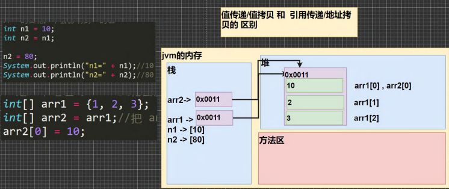

# 笔记

多积累，多思考 ，培养建立编程思想
听懂了以后，对于应用场景还是比较模糊的，只有多去听，多去练习，把java 语言与业务逻辑关联起来。 听懂的只是它的原理和语法，你要去认识它的应用场景，到底体现在什么地方

## 静态属性什么时候加载？ 

## 集合的三种遍历方法？

类的五大成员是哪些？（属性、方法、构造器、代码块、内部类）


## 接口

### 接口的注意事项和细节

1. 接口中的属性，只能是final的，而且是 public static final 修饰符。
   比如：int a =1; 实际上是 public static final int a = 1;（必须初始化，也就是说在接口中定义的时候必须赋值）
2. 接口中属性的访问形式：接口名.属性名。
3. 接口的修饰符，只能是public 和默认，这点和类的修饰符是一样的。

其他注意事项

1. 接口不能被实例化
2. 一个类可以实现多个接口
3. 一个普通类实现接口，就必须将该接口的所有方法都实现
4. 抽象类实现接口，可以不用实现接口的方法
5. 接口不能继承其它的类，但是可以继承多个别的接口
6. 接口中所有的方法是 public 方法，接口中抽象方法，可以不用abstract 修饰
   例如：void  aaa();  实际上是 abstract void aaa()
7. 指代原因不明确错误问题：访问接口的 x 就使用 A.x。/访问父类的 x 就使用 super.x 

### 基本介绍

接口就是给出一些没有实现的方法，封闭到一起。到某个类要使用的时候，在根据具体情况把这些方法写出来。

语法：

```java
interface 接口名{
    //属性
    //抽象方法
}

class 类名 implements 接口{
    //自己属性
    //自己方法
    //必须实现的接口的抽象方法
}
```

小结：

1. 接口就是更加抽象的抽象类，抽象类里的方法可以有方法体，接口里所有方法都没有方法体【jdk 7.0】。
   jdk8.0即jdk8.0后接口类可以有静态方法(static)，默认方法(default)，也就是说接口中可以有方法的具体实现
2. 接口体现了程序设计的多态和**高内聚低偶合**的设计思想。
3. 如果子类需要扩展功能时，可以通过实现接口的方式扩展
   可以理解 实现接口 是对 java 单继承机制的一种补充。
4. 继承的价值主要在于：解决代码的**复用性和可维护性**
   接口的价值主要在于：**设计**，设计好各种规范（方法），让其他类去实现这些方法。更加灵活...
5. 继承是满足 is-a的关系，而接口只需要满足like-a的关系
6. 接口在一定程序**上实现代码解耦**（**接口规范性+动态绑定机制**）
7. 接口的多态传递现象

接口的使用：

## 动态绑定？继承？多态？

绑定运行类型

接口的多态？

## 内部类

内部类**最大的特点就是可以直接访问私有属性**，并且可以体现类与类之间的包含关系。
内部类是学习的难点，同时也是重点，后面看底层源码时，有大量的内部类

定义在类的局部位置：（方法中/代码块）

- 局部内部类
- **匿名内部类**

定义在类的成员位置：

- 成员内部类
- 静态内部类

### 1、局部内部类

​	语法：
​		

```java
class Outer {  // 外部类
	public void m1(){//方法
        class Innner{ //局部内部类

        }
    }
}
class Outher1{//外部其他类

}
```

​		注意事项：

- 局部内部类地位是一个局部变量。（可以直接访问外部类的所有成员，包含私有的，不能添加访问修饰符，但可以使用final修饰，因为局部变量也可以使用final,作用域：仅是在定义它的方法或代码块中）

- 访问：

  局部内部类--访问-->外部类的成员（直接访问）
  外部类--访问-->局部内部类的成员
  （创建对象，再访问，注意外部类的定义域：仅仅在定义它的方法或代码块中）
  外部其他类--不能访问-->局部内部类（因为局部变量也不能访问是吧）

- 重名：
  就近原则 
  想访问外部类的成员，使用（外部类名.this.成员）
  外部类名.this 就是调用 这个成员的 对象（外部类的他自己去访问成员当然就是外部类的属性，这是理所当然的事情）

### 2、匿名内部类（重要）

- 匿名内部类同时还是一个对象（因为你在使用的时候肯定会new 嘛）。
- 匿名内部类的类名是被隐藏起来的。

​	语法：

```java
new  类或接口(参数列表){
    类体
}；
```

#### a、基于接口的匿名内部类：

```java
IA tiger =  new Tiger();//传统写法
//IA是一个接口，Tiger 是一个实现了IA接口的类。接口类型可以指向实现了该接口的类的对象实例
tiger.try();
//需求：Tiger 只用一次，就定义一个类，有点浪费。是吧。定义太多类，也太烦了吧，所以就用匿名内部类简化开发
IA tiger = new IA(){
    @Override
    public void cry(){
        System.out.println("老虎叫唤");
    }
}
tiger.try();//现在效果就是一样的


//匿名内部类的特点： 
//		tiger的编译类型？ 看等号左边，IA
//		tiger的运行类型？ 看等号右边，
//		是一个接口呀？	不，是一个匿名内部类。 底层自动分配一个 XXXX的类名。
				     

```

```java
//底层
class XXXX implements IA{
	自己重写的东西就是那个cry()
}。
```

#### b、基于类的匿名内部类

```java
A a = new A(参数列表/无);//传统写法
A a = new A(参数列表/无){//基于类的匿名内部类
   // 自己重写的方法，当然你也可以不写，又不是抽象类/接口
};
//匿名内部类的特点：
//a 的编译类型 看等号左边 A
//a 的运行类型 看等号右边 自动分配的 XXXX
```

```java
//底层
//和基于接口的匿名内部类一个德性
class XXXX extend A{
   //自己重写的方法，当然你也可以不写，又不是抽象类/接口
}
```

XXXX 底部自动分配的类名其实是 （外部类名+$ +数字从1开始，例如Outer$1，不相信可以用 tiger.**getClass**看一下它的类型是不是输出自动分配的那个）

​		注意事项：（**把下面的局部内部类换成匿名内部类即可**）

- 局部内部类地位是一个局部变量。（可以直接访问外部类的所有成员，包含私有的，不能添加访问修饰符，但可以使用final修饰，因为局部变量也可以使用final,作用域：仅是在定义它的方法或代码块中）

- 访问：

  局部内部类--访问-->外部类的成员（直接访问）
  ~~外部类--访问-->局部内部类的成员（这条没有）~~
  ~~（创建对象，再访问，注意外部类的定义域）~~
  外部其他类--不能访问-->局部内部类（因为局部变量也不能访问是吧）

- 重名：
  就近原则 
  想访问外部类的成员，使用（外部类名.this.成员）

​		其他注意事项:

- 可以直接当做一个对象来使用，直接调用方法

  ```java
  /**
   * @author 王俊彪
   * @version 1.0
   * 举一反三，基于接口，类，抽象类都可以这样使用
   */
  public class Ceshi{
      public static void main(String[] args) {
          new A(){
              @Override
              public void say() {
                  System.out.println("您好");
              }
          }.say();
      }
  }
  interface A{
      public void say();
  }
  ```

#### c、基于抽象类的匿名内部类

​	可以略过了，你应该可以想象到它和基于类的有什么区别（就是必须要重写方法）

#### 匿名内部类的实践

当做实参直接传递，简洁高效！！！

1、


这样属于**硬编码**，如果多次使用还好，但是如果写了的话，其他地方也就都改了，所以不推荐！！！

使用了匿名内部类后更加灵活了。传统方法呢就更统一一些
//举例的f1 是一个静态方法，并将传进去的接口/类，运行show方法

2、


```java
/**
 * @author 王俊彪
 * @version 1.0
 * 和老韩想的有点不一样，我是用了构造器了，得到教训，能用方法，尽量用方法，不用构造器。"学一手"
 */
public class Ceshi{
    public static void main(String[] args) {
        Cellphone cellphone = new Cellphone();
        cellphone.alarmClock(new Bell() {
            @Override
            public void ring() {
                System.out.println("懒猪起床了");
            }
        });
        cellphone.alarmClock(new Bell() {
            @Override
            public void ring() {
                System.out.println("小伙伴们上课了");
            }
        });
    }
}
interface Bell{
    public void ring();
}
class Cellphone {
    //闹钟功能
    public void alarmClock(Bell bell){//虽然运行类型是bell，但编译类型是一直变化的。
       System.out.println(bell.getClass());
        bell.ring();//实现了动态绑定 
    }
}
```

### 3、成员内部类

语法：

```java
class outer{//外部类
	class Inter{//成员内部类
        
    }
}
```

 注意事项：

- 成员内部类地位是一个成员。（可以直接访问外部类的所有成员，包含私有的，可以添加任意访问修饰符（public、protected、默认、private）,因为地位是一个成员嘛，作用域：和外部类的其他成员一样，为整个类体）

- 访问：

  成员内部类--访问-->外部类的成员（直接访问）
  外部类--访问-->成员内部类的成员
  （创建对象，再访问）
  外部其他类--访问-->成员内部类（不同于上面两种，这里是可以访问的，而且还有三种访问方式，如下：）

  ```java
  //第一种方式：(一个新奇的语法，"学一手")
  Outer outer = new Outer();
  Outer.Inter inter = outer.new Inter();//相当于把后成的new Inter() 当做outer的成员，注意outer 是小写的对象名
  ```

  ```java
  //第二种方式，返回一个成员内部类的对象
  Outer outer = new Outer();
  Outer.Inter inter = outer.getInter()；//就是把第一种方式的new Inter换成了getInter()
  ```

  ```java
  //第三种方式,其实就是把前面两种合起来,简洁一点
   Outer.Inter inter = new Outer().new Inter();
  ```

- 重名：
  就近原则 
  想访问外部类的成员，使用（外部类名.this. ）
  外部类名.this 就是调用 这个成员的 对象（外部类的他自己去访问成员当然就是外部类的属性，这是理所当然的事情）

### 4、静态内部类

语法：

```java
class outer{//外部类
	static class Inter{//静态内部类
        
    }
}
```

注意事项：（**静态方法只能访问静态成员，当然静态类也只能访问静态成员**）

- ~~成员~~   静态内部类地位是一个成员。（可以直接访问外部类的所有成员，包含私有的，可以添加任意访问修饰符（public、protected、默认、private）,因为地位是一个成员嘛，（**但不能直接访问非静态成员**），作用域：和外部类的其他成员一样，为整个类体）

- 访问：

   静态内部类--访问-->外部类的成员（直接访问（**静态成员**））
  外部类--访问-->静态内部类的成员
  （创建对象，再访问）
  外部其他类--访问-->静态内部类（ 有三种访问方式，如下：）

  ```java
  //第一种方式，因为静态内部类，是可以通过类名直接访问（前提是满足访问权限）
  Outer.Inter inter = new Outer.Inter();//不过要注意Inter 别设成私有的，设成私有的肯定就访问不到了呀
  ```

  ```java
  //第二种方式
  Outer outer = new Outer();
  Outer.Inter inter = outer.getInter();
  ```

  ```java
  //第三种方式
  Outer.Inter inter = Outer.getInter();//把getInter设置成静态的连对象都不用创建
  ```

- 重名：
  就近原则 
  想访问外部类的成员，使用（**外部类名.成员** ）  

## 类什么时候加载

- 当创建对象时（new)  //静态加载
- 当子类被加载时，父类也加载  //静态加载
- 调用类中的静态成员时  //静态加载

## 访问修饰符


## 单例设计模式是什么？


就是：在这个程序从开始运行到结束，要保证某个类只能有一个实例，不可以在有第二个。比如在做开发时有一个类是重量级的非常耗费资源，但实际上我们只需要一个，这时就体现了价值。

### 1、饿汉式

**饿汉式：即使你没有使用到这个对象，但是在类加载的时候就被加载了，所以很饿**可能造成创建了没有使用，造成浪费。


```java
/**
 * @author 王俊彪
 * @version 1.0
 * 演示饿汉式
 */
public class Ceshi {
    public static void main(String[] args) {
        GirlFriend girlFriend1 = GirlFriend.getInstance();
        System.out.println(girlFriend1.getName());
        GirlFriend girlFriend2 = GirlFriend.getInstance();
        System.out.println(girlFriend2.getName());
        System.out.println(girlFriend1==girlFriend2);
		//true
    }
}
class GirlFriend{
    private String name;

    private static GirlFriend gf = new GirlFriend("小红红");
    //为什么要用static，因为不用static ，下面getInstance 中就不用用gf了
    private GirlFriend(String name) {
        this.name = name;
    }
    public static GirlFriend getInstance(){//instance:实例
        return gf;
    }

    public String getName() {
        return name;
    }

    public void setName(String name) {
        this.name = name;
    }

    public static GirlFriend getGf() {
        return gf;
    }

    public static void setGf(GirlFriend gf) {
        GirlFriend.gf = gf;
    }
}

```

### 2、懒汉式

只有使用的时候才创建这个对象

```java
/**
 * @author 王俊彪
 * @version 1.0
 * 演示饿汉式
 */
public class Ceshi {
    public static void main(String[] args) {

        System.out.println(GirlFriend.n1);

    }
}
class GirlFriend{
    private String name;

    private static GirlFriend gf ;
    public static  int n1 =200;
    //为什么要用static，因为不用static ，下面getInstance 中就不用用gf了
    private GirlFriend(String name) {
        System.out.println("这里是不会调用的");
        this.name = name;
    }
    public static GirlFriend getInstance(){//instance:实例
        if(gf==null){
            gf = new GirlFriend("小红红");
        }
        return gf;
    }

    public String getName() {
        return name;
    }

    public void setName(String name) {
        this.name = name;
    }

    public static GirlFriend getGf() {
        return gf;
    }

    public static void setGf(GirlFriend gf) {
        GirlFriend.gf = gf;
    }
}
```

其实一共有八种单例

## 类变量与类方法（未完待继）

#### 类变量引出


引出问题,在**面向对象的编程**语言中竟然自己定义了一个独立变量去记录，这也不合更理呀，以后访问也有问题呀，是吧。

所以用类变量来实现**对象共享**一个成员属性
加上static 称为类变量或静态变量，否则称为实例变量/普通变量/非静态变量

#### 类变量的内存布局


类变量在呢的说法有两种（1、不管在那都不影响它共享的使用，2、类变量在类加载的时候生成）

- 放在堆里面（和反射有关系）
- 放在方法区的静态域里面（jdk8以前是）


## jvm内存布局


### 方法的内存图


## 数组

### 一维数组 ：

就是一组数组 ；介绍：

- 数组可以存放多个同一类型的数据。
- 数组也是一种数据类型，是引用类型

#### 数组的使用

##### a、动态初始化

```java
//第一种动态分配方式
int a [] = new int [5];
//第二种动态分配方式，称声明数组，再new 分配空间
int a [];
a = new int [5];
```

##### b、静态初始化

```java
//静态初始化
int a [] = {1,2,3,4,5,6,7};

```

小难点：for each 循环

```java
/**
 * @author 王俊彪
 * @version 1.0
 * for each 循环阻止不了对象数组的改值。
 */
public class Ceshi {
    public static void main(String[] args) {
        Value [] values = new Value[10];
        for (int i = 0; i < values.length; i++) {
            values[i]=new Value();//注意这里是不能省略的
            //因为对象数据在一开始不赋值时，会赋默认值null。
            //null.setNum(9999); 显然是不对的。"学一手"
            values[i].setNum(9999);
        }
        for(Value V : values){
            V.setNum(999);
        }
        for (int i = 0; i < values.length; i++) {
            System.out.println(values[i].getNum());
        }
    }
}
class  Value{
    int num;

    public int getNum() {
        return num;
    }

    public void setNum(int num) {
        this.num = num;
    }
}
```

注意事项：

- 数组如果没有赋值，有默认值 

  int 0 , short: 0,byte: 0 long: 0, float: 0.0 , double: 0.0 , char \u0000 （Unicode 空格）, boolean: false, String null

- 数组里面是相同类型的数据或者可以实现自动转换

- 数组属引用类型，数组型数据是对象（object）

- **数组**在默认情况下是引用传递，赋的值是地址（如下 ：**数组赋值的内存图**）

数组赋值机制



相关操作：数组拷贝、数组反转。这就不用说了

数组扩容 （可优化）

```java
import java.lang.reflect.Array;
import java.util.Scanner;

/**
 * @author 王俊彪
 * @version 1.0

 */
public class Ceshi {
    public static void main(String[] args) {
        Scanner scanner = new Scanner(System.in);
        int [] arr = {1,2,3};
        char key=0;
        boolean flag=true;
        do {
            System.out.print("您是否要进行扩容y/n:");
            key = scanner.next().toUpperCase().charAt(0);
            switch (key){
                case 'Y':
                    System.out.print("请输入您要添加的值：");
                    int n = Integer.parseInt(scanner.next());
                    int newArr [] = new int[arr.length+1];

                    for (int i = 0; i < arr.length; i++) {
                        newArr[i]=arr[i];
                    }
                    newArr[arr.length]=n;
                    arr=newArr;
                    System.out.print("扩容后的各值为：");
                    for (int j = 0; j < arr.length; j++) {
                        System.out.print(arr[j]+" ");
                    }
                    break;
                case 'N':
                    flag=false;
                    break;
                default:
                    System.out.println("您输入的不正确，请重新输入");
                    break;
            }

        }while (flag);
    }
}
```

有缺陷比如这个数组特别特别的大，工作量就很大了，还可以进行一系列优化（数据结构：链表）

### 排序（只讲两种）


数据量大，只能用外部排序

#### 冒泡排序 

```java
import java.lang.reflect.Array;
import java.util.Scanner;

/**
 * @author 王俊彪
 * @version 1.0
 */
public class Ceshi {
    public static void main(String[] args) {
        int [] arr ={24,69,80,57,13};
        int temp=0;
        for (int i = 0; i < arr.length-1; i++) {
            for (int j = 0; j < arr.length-1-i; j++) {
               if(arr[j]>arr[j+1]){
                   temp=arr[j];
                   arr[j]=arr[j+1];
                   arr[j+1]=temp;
               }
            }
        }

        for (int i = 0; i < arr.length; i++) {
            System.out.print(arr[i]+" ");
        }
    }
}
```

#### 查找 （顺序查找）

也可以用二分查找 （在算法中讲解）

```java
import java.lang.reflect.Array;
import java.util.Scanner;

/**
 * @author 王俊彪
 * @version 1.0
 */
public class Ceshi {
    public static void main(String[] args) {
        String [] names = {"白眉鹰王","金毛狮王","紫衫龙王","青翼蝠王"};
        Scanner scanner = new Scanner(System.in);
        System.out.print("请输入您要查找的名字：");
        String name = scanner.next();
        //一个经典的使用方式
        int index = -1;
        for (int i = 0; i < names.length; i++) {
            if(names[i].equals(name)){
                System.out.println("恭喜您找到了"+name+"的下标为："+i);
                index=i;
                break;
            }
        }
        if(index == -1){//没找到
            System.out.println("sorry 没有找到"+name);
        }
    }
}
```

### 二维数组

形式：int [] [];
理解：原来的一维数组的每个元素是一个一维数组，所以就构成了二维数组。

二维数组由多个一维数组组成，各个一维数组长度可以相同也可以不同

#### 数组的使用

##### a、动态初始化

```java
//第一种方式
int [][] arr = new int [5][5];
//第二种方式
int arr [][];
arr = new int[5][5];
//第三种方式（用于列数不确定）
int [][] arr = new int [3][];
for (int i =0;i<arr.length;i++){
    //给每个一维数组开空间 new，
    //如果没给一维数组 new ,那么 arr[i] 就是null
    arr[i] = new int[i+1];
    for(int j =0;j<arr[i].length;j++){
        arr[i][j]=i+1;//赋值
    }
}
```

##### b、静态初始化

```java
//一种方法
int [][] = arr {{1},{2,3},{4,5,6}};
```

##### 懵逼初始化写法：

```java
int [] arr; == int [] arr;
int [][] arr; == int [][] arr;


String strs [] = new String []{"a","b","c"};//这是一个一维数组，闲得蛋疼，加了一个new String [];而且等号后面的括号里不要写具体的数字，写了反而不对
for (int i = 0; i < strs.length; i++) {
        System.out.println(strs[i]);
}
```


#### 二维数组的内存图


根据这张图三维数组 ，四维数组 也就可以推出来了

课后小练习（插入+扩容 ）

```java
import java.lang.reflect.Array;
import java.util.Scanner;

/**
 * @author 王俊彪
 * @version 1.0
 */
public class Ceshi {
    public static void main(String[] args) {
        int[] arr = {10, 12, 45, 90};
        int insertNum = 23;
        int index = -1;

        for (int i = 0; i < arr.length; i++) {
            if (insertNum <= arr[i]) {
                index = i;
                break;
            }
        }
        if (index == -1) {//说明没有找到位置，比所有的都大，应该加到最后
            index = arr.length;
        }

        //扩容
        int[] newArr = new int[arr.length+1];
        //用 i 来控制新数组 ，用 j 来控制原来数组,i和j用的挺妙 "学一手"
        for (int i = 0, j = 0; i < newArr.length; i++) {
            if (i != index) {
                newArr[i]=arr[j];
                j++;
            }else{
                newArr[i]=insertNum;
            }
        }
        arr=newArr;
        //原来数组 arr 被销毁
        for (int i = 0; i < arr.length; i++) {
            System.out.print(arr[i]+",");
        }

    }
}


```

## 各类编码

### 1、ASCII码

ASCII码，是上世纪60年代，美国制定的字符编码，使用一个字节，表示英语字符与二进制之间的关系，一共规定了128个字符编码，最前面的1位不算统一用0。所以ASCII码只用了128个字符 ，虽然可以表示256个字符 
缺点就是：不能表示所有字符 

### 2、Unicode编码

将世界上所有的符号都纳入其中，使用Unicode没有乱码的问题。
缺点：一个英文和一个汉字都占2个字节，对存储空间浪费

最多表示2的16次方，65535个字符
编码0~127和ASCII编码一样，如0X61和0X0061

### 3、UTF-8编码

在Unicode的实现方式上进行改进。（使用1-6个字节表示一个符号）
字母占1个字节，汉字占3个字节

## 数据类型


### 自动类型转换


感觉String 是特殊的引用数据类型吧，它放在常量池中

## IO流

### 文件


#### 概念：

文件就是保存数据的地方

文件流：文件在程序中是以流的形式来操作的


#### 常用操作：


创建File对象，并用createNewFile 方法创建新文件(如果原本就有，不会覆盖)

```java
import java.io.File;
import java.io.IOException;

/**
 * @author 王俊彪
 * @version 1.0
 * 文件创建 createNewFile();
 */
public class Ceshi {
    public static void main(String[] args) {
        //方法1：
        String filePath ="D:\\Microsoft账户\\OneDrive\\桌面\\java文件\\child1.txt";
        File file = new File(filePath);
        try {
            file.createNewFile();
            System.out.println("创建成功~");
        } catch (IOException e) {
            e.printStackTrace();
        }
        //方法2：
        String parentPath = "D:\\Microsoft账户\\OneDrive\\桌面\\java文件\\";
        String childPath = "child2.txt";
        File file1 = new File(parentPath,childPath);//根据父目录文件+子路径构建
        try {
            file1.createNewFile();
            System.out.println("创建成功！");
        } catch (IOException e) {
            e.printStackTrace();
        }
        //方法3：
        String parentPath2 = "D:\\Microsoft账户\\OneDrive\\桌面\\java文件\\";
        String childPath2 = "child3.txt";
        File file2 = new File(parentPath2, childPath2);
        try {
            file2.createNewFile();
            System.out.println("创建成功...");
        } catch (IOException e) {
            e.printStackTrace();
        }

    }
}
```

```java
import java.io.File;
import java.io.IOException;

/**
 * @author 王俊彪
 * @version 1.0
 * 常用操作：getName、getAbsolutePath、getParent、length、exists、isFile、isDirectory
 */
public class Ceshi {
    public static void main(String[] args) {
        String filePath ="D:\\Microsoft账户\\OneDrive\\桌面\\java文件\\child1.txt";
        File file = new File(filePath);
        System.out.println("文件的名字= "+ file.getName());
        System.out.println("文件的绝对路径= "+ file.getAbsolutePath());
        System.out.println("文件的父级目录= "+ file.getParent());
        System.out.println("文件的大小（字节）= "+ file.length());//9
        System.out.println("文件是否存在= "+ file.exists());//true
        System.out.println("是不是一个文件= "+ file.isFile());//true
        System.out.println("是不是一个目录= "+ file.isDirectory());//false
    }
}
```

创建一级目录 mkdir( ) 、创建多级目录 mkdirs ( ) 、 delete删除空目录或文件

```java
import java.io.File;
import java.io.IOException;

/**
 * @author 王俊彪
 * @version 1.0
 * 创建目录、删除目录
 */
public class Ceshi {
    public static void main(String[] args) {
        String filePath ="D:\\Microsoft账户\\OneDrive\\桌面\\java文件\\child1";
        File file = new File(filePath);
        System.out.println("是不是一个目录= "+ file.isDirectory());//false
        System.out.println(file.mkdir());//true
        System.out.println("是不是一个目录= "+ file.isDirectory());//true

        System.out.println(file.delete());//true

        String filePath2 ="D:\\Microsoft账户\\OneDrive\\桌面\\java文件\\child1\\child2";
        System.out.println(file.mkdirs());//true

    }
}
```

```java
import java.io.File;
import java.io.IOException;

/**
 * @author 王俊彪
 * @version 1.0
 * 练习：
 * 查看是否有该目录有说明，没有就创建
 */
public class Ceshi {
    public static void main(String[] args) {
        String filePath ="D:\\Microsoft账户\\OneDrive\\桌面\\java文件\\a\\b\\c";
        File file = new File(filePath);

        if(file.exists()){
            System.out.println("已经存在~");
        }else{
            file.mkdirs();
            System.out.println("创建成功！");
        }

    }
}
```

### I/O介绍与分类

I/0技术是非常实用的技术，用于处理数据传输。如读/写文件，网络通讯。等。并且是在java .io包下面提供的。

#### 流的分类

按操作数据单位不同分为：1、字节流（8 bit） 二进制文件 ； 2、字符流（按字符）文本文件

按数据流的流向不同分为：输入流，输出流。

按流的角色的不同分为：节点流、处理流  /  包装流。

java io流共涉及40多个类，实际上是从4个抽象基类派生出来的：

```java
//InputStream
//OutputStream
//Reader
//Writer
```

**IO体系图**


### 第1组、FileInputStream ， FileOutputStream (字节输入输出流)

注意：关闭流； 
如果是文本文件，用read()方法容易出现乱码

#### **FileInputStream**


```java
import java.io.File;
import java.io.FileInputStream;
import java.io.FileNotFoundException;
import java.io.IOException;

/**
 * @author 王俊彪
 * @version 1.0
 * FileInputSream 输入流
 */
public class Ceshi {
    public static void main(String[] args) {
        String filePath ="D:\\Microsoft账户\\OneDrive\\桌面\\java文件\\hello.txt";
        FileInputStream fileInputStream = null;
        byte [] buf =  new byte [8];
        try {
            fileInputStream = new FileInputStream(filePath);
            int readlen=0;
            while ((readlen=fileInputStream.read(buf))!=-1){
                System.out.print(new String(buf,0,readlen));//用数组方式，只不过效率提高了，还是有可能出现乱码
            }
        } catch (IOException e) {
            e.printStackTrace();
        }finally {
            if(fileInputStream!=null){
                try {
                    fileInputStream.close();
                } catch (IOException e) {
                    e.printStackTrace();
                }
            }
        }
    }
}
```

#### FileOutputSteam


```java
import java.io.*;

/**
 * @author 王俊彪
 * @version 1.0
 * FileOutputStream 写入
 */
public class Ceshi {
    public static void main(String[] args) {
        String filePath ="D:\\Microsoft账户\\OneDrive\\桌面\\java文件\\hello1.txt";
        FileOutputStream fileOutputStream = null;
        try {
            fileOutputStream = new FileOutputStream(filePath,true);//如果第二个参数是true 那么就会追加！
            //写入一个字节
            fileOutputStream.write('H');
            //写入一个字符串
            String str = "hello world 王俊彪！";
            fileOutputStream.write(str.getBytes());
            //写入一个字符串，规定从那到那
            fileOutputStream.write(str.getBytes(),0,3);
        } catch (IOException e) {
            e.printStackTrace();
        }finally {
            if(fileOutputStream!=null){
                try {
                    fileOutputStream.close();
                } catch (IOException e) {
                    e.printStackTrace();
                }
            }
        }


    }
}
```

#### 文件拷贝

```java
import java.io.*;

/**
 * @author 王俊彪
 * @version 1.0
 * 查看是否有该目录有说明，没有就创建
 */
public class Ceshi {
    public static void main(String[] args) {
        String srcFilePath="D:\\Microsoft账户\\OneDrive\\桌面\\java文件\\d\\wb.png";
        String destFilePath="D:\\Microsoft账户\\OneDrive\\桌面\\java文件\\e\\wb2.png";

        FileInputStream fileInputStream = null;
        FileOutputStream fileOutputStream = null;

        //定义一个数组提高读取效率
        byte [] buf = new byte[1024];

        try {
            fileInputStream=new FileInputStream(srcFilePath);
            fileOutputStream= new FileOutputStream(destFilePath);
            int readLen=0;
            if((readLen=fileInputStream.read(buf))!=-1){
//                fileOutputStream.write(buf);
                fileOutputStream.write(buf,0,readLen);//注意这里一定要用这种写法，上面万一，是吧。可能会不正确"学一手"

                System.out.println("拷贝成功~");
            }

        } catch (IOException e) {
            e.printStackTrace();
        }finally {
            try {
                if(fileInputStream!=null){
                    fileInputStream.close();
                }
                if(fileOutputStream!=null){
                    fileOutputStream.close();
                }
            } catch (IOException e) {
                e.printStackTrace();
            }
        }
    }
}
```

### 第2组、FileReader ，FileWriter (字符输入输出流)

#### FileReader


```java
import java.io.*;

/**
 * @author 王俊彪
 * @version 1.0
 * FileReader 字符读入的两种方法
 */
public class Ceshi {
    public static void main(String[] args) {
        String filePath="D:\\Microsoft账户\\OneDrive\\桌面\\java文件\\hello.txt";
        FileReader fileReader = null;

        try {
            //第一种方式，普通方法
//            int readDate=0;
//            fileReader=new FileReader(filePath);
//            while((readDate=fileReader.read())!=-1){
//                System.out.print((char)readDate);
//            }
            //第二种方式，用数组读取
            char [] chars = new char[8];//注意这里一定要用char ,8这个数字 自己定
            //咱这里说读8个字符就读8个字符；
            fileReader=new FileReader(filePath);
            int readLen=0;
            while ((readLen=fileReader.read(chars))!=-1){
                System.out.print(new String(chars,0,readLen));//输入看看用new String方式
            }
        } catch (IOException e) {
            e.printStackTrace();
        } finally {
            if(fileReader!=null){
                try {
                    fileReader.close();
                } catch (IOException e) {
                    e.printStackTrace();
                }
            }
        }
    }
}
```

#### FileWriter

注意细节：FileWriter使用后，必须要关闭或刷新，否则写入不到指定的文件！！

close( )  =  flush( )+关闭


```java
import java.io.*;

/**
 * @author 王俊彪
 * @version 1.0
 * FileReader 字符输出的5种方法
 */
public class Ceshi {
    public static void main(String[] args) {
        String filePath="D:\\Microsoft账户\\OneDrive\\桌面\\java文件\\note.txt";
        FileWriter fileWriter = null;

        try {
            fileWriter= new FileWriter(filePath);
            //写入一个字符
//            fileWriter.write('王');
            //写入指定数组
//            char [] chars = {'王','俊','彪'};
//            fileWriter.write(chars);
            //写入数组指定部分
//            char [] chars = {'王','俊','彪'};
//            fileWriter.write(chars,0,2);
            //写入整个字符串
//            String str= "风雨之后 ，必见彩虹！";
//            fileWriter.write(str);
            //写入字符串的指定部分
            String str = "风雨之后 ，必见彩虹！";
            fileWriter.write(str,0,4);


        } catch (IOException e) {
            e.printStackTrace();
        }finally {
            // 一定记得关流
            if(fileWriter!=null){
                try {
                    fileWriter.close();
                } catch (IOException e) {
                    e.printStackTrace();
                }
            }
        }
    }
}
```

### 节点流和处理流/包装流的概念


节点流：直接针对某一个具体的数据源进行操作
包装流：对节点流进行包装，让它的功能更加强大


节点流就是上面访问文件的，访问数组 ……
包装流包括，缓冲流、转换流、对象流、打印流……


证明确实是包装

包装完以后就不在局限于，文件只能用文件的节点流，数组只能用数组的节点流
