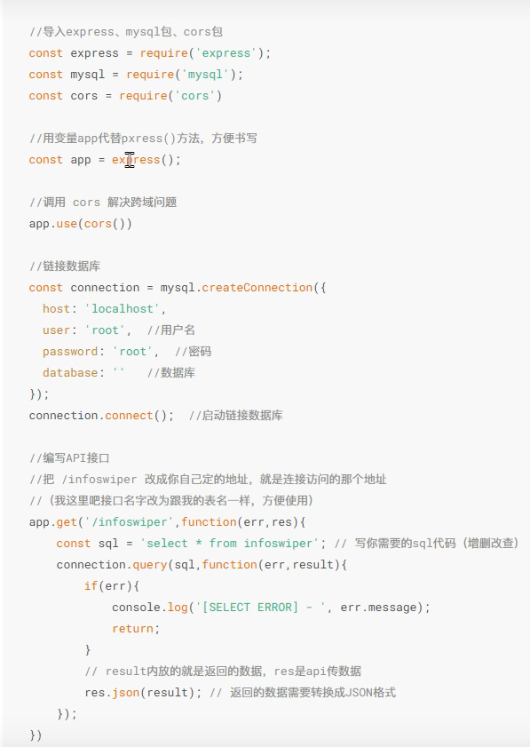

# vue-vite使用

## 文件介绍

src\main.js 文件：是项目的入口文件；
src\App.vue文件：Vue3 工作区是由各种组件组成的，src\App.vue文件是项目的根组件；
index.html文件：是页面的入口文件；

使用Vite构建Vue！ 3项目后，当执行yarn dev命令启动服务时，项目就会运行起来，该项目会通过src\main.js文件将src\App.vue组件渲染到index.html文件的指定区域。

## 单文件组件 

每个.vue文件都可用来定义一个单文件组件。

Vue中的单文件组件是Vue组件的文件格式

单文件组件 由模板、样式和逻辑3个部分构成

模板：用于搭建当前组件的DOM结构 
样式：为当前组件设置样式
逻辑：<script></script>  代码处理组件和数据与业务

## 数据绑定

数据绑定：定义数据并将数据渲染到页面

Vue 通过数据绑定实现了数据与页面相分离，从面实现了数据驱动视图的效果。

### 定义数据 

使用setup语法糖

```vue
<script setup>
const 数据名 = 数据值
</script>
```

### 输出数据

使用双大括号语法 

```vue
{{ 数据名 }}
```

### 将vue引入html

不常用，知道就行

```vue
<!DOCTYPE html>
<html>
<head>
  <meta charset="UTF-8">
  <title>Hello World案例</title>
  <script src="https://unpkg.com/vue@3/dist/vue.global.js"></script>
</head>
<body>
  <div id="app">
    <p>{{ message }}</p>
  </div>
  <script>
    const vm = Vue.createApp({
      setup() {
        return {
          message: 'Hello World!'
        }
      }
    })
    vm.mount('#app')
    </script>
        
</body>
</html>
```

### 响应式数据绑定

- ref()函数
- reactive()函数
- toRef()函数
- toRefs()函数

#### ref()函数

​	用于将数据转换成响应式数据

```vue
//引入 
import { ref } from 'vue'
//定义
响应式数据 = ref(数据 )
//更改
响应式数据.value = 新值 
```

```vue
<template>
  <div class="demo">{{ Message }}</div>
</template>
  <style>
.demo {
  font-size: 22px;
  font-weight: bold;
}
</style>
  <script setup>
import { ref ,reactive} from "vue";

const Message = ref("会当凌绝顶，一览众山小");
setTimeout(() => {
    Message.value = "锲而不舍，金石可镂";
  },
  2000);
</script>
```


#### reactive()函数

​	用于创建一个响应式对象式数组 

```
//引入 
import { reactive } from 'vue'
//定义对象
响应式对象或数组 = reactive(普通的对象或数组)
//修改数据
直接改就行，对象名.属性名
```

```vue
<template>
  <div class="demo">{{ obj.massage }}</div>
</template>
  <style>
.demo {
  font-size: 22px;
  font-weight: bold;
}
</style>
  <script setup>
import { ref ,reactive} from "vue";

const obj=reactive({
  massage:"不畏浮云遮望远，只缘身在此山中"
})
setTimeout(()=>{
  obj.massage="欲穷千里目，更上一层楼"
},2000)
</script>
```

#### toRef()函数

用于将响应式对象中的单个属性转换为响应式数据 

```
//引入 
import {reactive ,toRef} from 'vue'
//定义
响应式数据 = toRef(响应式对象，'属性名')
//修改
还是对象名.属性名
```

```vue
<template>
  <div class="demo">massage 的值 {{ massage }}</div>
  <div class="demo">obj.massage 的值 {{ obj.massage }}</div>
</template>
  <style>
.demo {
  font-size: 22px;
  font-weight: bold;
}
</style>
  <script setup>
import { ref ,reactive,toRef} from "vue";

const obj=reactive({
  massage:"黑发不知勤学早，白首方悔读书迟"
})
const massage = toRef(obj,'massage')
setTimeout(()=>{
  obj.massage="少壮不努力，老大徒伤悲"
},2000)
</script>
```

#### toRefs()函数

用于将响应式对象中所有属性转换为响应式数据

```vue
//引入 
import {reactive,toRefs} from 'vue'
//定义
所有属性组成的对象 = toRefs(响应式对象)
```

```vue
<template>
  <div class="demo">massage 的值 {{ massage }}</div>
  <div class="demo">obj.massage 的值 {{ obj.massage }}</div>
</template>
  <style>
.demo {
  font-size: 22px;
  font-weight: bold;
}
</style>
  <script setup>
import {reactive,toRefs} from "vue";

const obj=reactive({
  massage:"盛年不重来，一日难再晨"
})

let {massage} = toRefs(obj)
setTimeout(()=>{
  obj.massage="及时当勉励，岁月不待人"
},2000)
</script>
```

## 指令

### 用于渲染DOS元素内容

- v-text
- v-html

#### 属性动态绑定

- v-bind

- 或者直接写一个：

  ```vue
  //<标签名 v-bind:属性名="数据名"></标签名>
  //v-bind还支持将属性与字符串拼接表达式绑定
  //<div :id="'list' + index"></div>
  
  <template>
    <p><input v-bind:placeholder="username"/></p>
    <p><input :placeholder="password"/></p>
  
  </template>
    <style>
  .demo {
    font-size: 22px;
    font-weight: bold;
  }
  </style>
    <script setup>
    const username="请输入用户名"
    const password="请输入密码";
  </script>
  ```

#### 事件动态绑定

- v-on：事件名

- 或者@事件名

  ```vue
  //<标签名 v-on:事件名="事件处理器"></标签名>
  <template>
    
    <button @click="showInfo">点击输出信息</button>
    <button v-on:click="showInfo">点击输出信息</button>
  
  </template>
    <style>
  .demo {
    font-size: 22px;
    font-weight: bold;
  }
  </style>
    <script setup>
    const showInfo = ()=>{
      alert("欢迎")
    }
  </script>
  ```

#### 双向数据绑定


- v-model

  ```vue
  <template>
    请输入姓名：<input type="text" v-model="username">
    <div>姓名是：{{username}}</div>
    请输入密码：<input type="text" v-model.number="password">
    <div>密码是：{{password}}</div>
  </template>
    <style>
  .demo {
    font-size: 22px;
    font-weight: bold;
  }
  </style>
    <script setup>
    import { ref } from 'vue';
    const username=ref('');
    const password=ref('');
  
  </script>
  ```

  textarea元素和text类型的input元素会绑定value属性和input事件。

  checkbox类型的input元素和radio类型的input元素会绑定checked属性和change事件。

  select元素会绑定value属性和change事件。

| **修饰符** | **作用**                                |
| ---------- | --------------------------------------- |
| .number    | 自动将用户输入的值转换为数字类型        |
| .trim      | 自动过滤用户输入的首尾空白字符          |
| .lazy      | 在change事件而非input事件触发时更新数据 |

```vue
//双向数据绑定计算器案例
<template>
  <input type="text" v-model.number= "n1">+
  <input type="text" v-model.number = "n2">=
  {{ n1+n2 }}
</template>
  <style>
.demo {
  font-size: 22px;
  font-weight: bold;
}
</style>
  <script setup>
  import { ref } from 'vue';
  const n1=ref(1)
  const n2=ref(2)

</script>
```

### 条件渲染指令

- v-if (v-if 、v-else-if、v-else)
- v-show

根据条件控制单个元素的显示或隐藏

v-show的原理是通过为元素添加或移除display: none样式来实现元素的显示或隐藏。

当需要频繁切换某个元素的显示或隐藏时，使用v-show会更节省性能开销；而当只需要切换一次显示或隐藏时，使用v-if更合理。

```vue
//v-if案例
//<标签名 v-if="条件"></标签名>
<template>
  小明的学习评定等级为：
  <p v-if="type === 'A'">优秀</p>
  <p v-if="type === 'B'">良好</p>
  <p v-if="type === 'C'">差</p>
  <button @click="type='A'">显示优秀</button>
  <button @click="type='B'">显示良好</button>
  <button @click="type='C'">显示差</button>
</template>
  <style>
.demo {
  font-size: 22px;
  font-weight: bold;
}
</style>
  <script setup>
  import { ref } from 'vue';
  const type=ref('B')

</script>
```

```vue
//v-show案例
<template>
 <p v-if="flag">通过v-if来控制的元素</p>
 <p v-show="flag">通过v-show来控制的元素</p>
 <button @click="flag=!flag">切换 显示/隐藏</button>
</template>
  <style>
.demo {
  font-size: 22px;
  font-weight: bold;
}
</style>
  <script setup>
  import { ref } from 'vue';
  const flag=ref(true)

</script>
```

### 列表渲染指令

当在list数组中删除一个元素后，index会发生变化，v-for会重新渲染列表，导致性能下降。

为了给v-for一个提示，以便它能跟踪每个节点的身份，从而对现有元素进行重用和重新排序，建议通过key属性为列表中的每一项提供具有唯一性的值

#### 渲染数组：

```vue
//示例：
//<div v-for="item in items" :key="item.id"></div>
<template>
  <div v-for="(item,index) in list" :key="index">
      索引是：{{ index }} 元素的内容是：{{ item }}
  </div>
</template>
  <style>
.demo {
  font-size: 22px;
  font-weight: bold;
}
</style>
  <script setup>
  import { ref } from 'vue';
  const list = ['html','css','js']
</script>
```

#### 渲染对象数组

```vue
<template>
  <div v-for="item in list" :key="item.id">
   索引为：{{ item.id }} 元素内容为：{{ item.massage }}
  </div>
</template>
  <style>
.demo {
  font-size: 22px;
  font-weight: bold;
}
</style>
  <script setup>
  import { reactive } from 'vue';
  const list = reactive(
    [
      {id:1,massage:"梅"},
      {id:2,massage:"兰"},
      {id:3,massage:"竹"},
      {id:4,massage:"菊"}
    ]
  )

</script>
```

#### 渲染对象

```vue
<template>
  <div v-for="(value , name) in user" :key="name">
   索引为：{{ name }} 元素内容为：{{ value}}
  </div>
</template>
  <style>
.demo {
  font-size: 22px;
  font-weight: bold;
}
</style>
  <script setup>
  import { reactive } from 'vue';
  const user = reactive(
    {id:1,name:"小明",gender:'男'}
  )

</script>
```


## 事件对象

事件对象是在事件触发时产生的对象，该对象保存了事件触发时的相关信息

两种获取方式

- 通过事件方法的参数获取 
- 通过$event获取

```vue
<template>
  <button @click="green">Green</button>
</template>
<script setup>
  const green = event =>console.log(event);
</script>
```

$event是Vue提供的内置变量，使用它可以获取事件对象

```vue
<template>
  <button @click="change($event)">change</button>
</template>
<script setup>
const change = event =>console.log(event)
</script>
```

演示事件对象的使用

```vue
<template>
  <div>count 的值 : {{ count }}</div>
  <button @click="addCount">count + 1</button>
</template>
<script setup>
import { ref } from "vue";
const count = ref(0);
const addCount = (event) => {
  count.value++;
  if (count.value % 2 === 0) {
    event.target.style.border = "3px dotted";
  } else {
    event.target.style.border = "3px solid";
  }
};
</script>
```

```vue
<template>
  <div>count 的值 : {{ count }}</div>
  <button @click="addCount(3,$event)">count + n</button>
</template>
<script setup>
import { ref } from "vue";
const count = ref(0);
const addCount = (n,event) => {
  count.value+=n;
  if (count.value % 2 === 0) {
    event.target.style.border = "3px dotted";
  } else {
    event.target.style.border = "3px solid";
  }
};
</script>
```

### 事件修饰符

事件修饰符与v-on 配合使用，以便于对事件进行控制。
事件修饰符用于修饰事件的行为。

#### 1、阻止默认事件行为

例如：在单击a标签时页面会自动跳转，这就是a标签的默认事件行为。（用.prevent）

```vue
<a href="test.html" v-on:click.prevent>阻止默认行为</a>

```

#### 2、阻止事件冒泡

同一时间子元素的事件执行，相同的父元素事件也执行，这样不好（用.stop）

```vue
<template>
  <div @click="show('我是父元素事件')">
      <button v-on:click="show('我是子元素事件')">事件冒泡</button>
      <button @click.stop="show('我是子元素事件')">阻止事件冒泡</button>
  </div>
</template>
<script setup>
const show =(message)=>{
  alert(message);
}
</script>
```

#### 3、事件捕获

当捕获存在时，先从外到里的捕获，剩下的从里到外的冒泡输出。(.capture)

```vue
<template>
  <div v-on:click="show('我是父元素的事件')">
    <button v-on:click.capture="show('我是子元素的事件')">事件捕获</button>
  </div>
</template>
<script setup>
let show = message =>  console.log(message)
</script>

```

#### 4、使事件只触发一次

(.once)

```vue
<template>
  <button @click.once="show('当前元素的单击事件只执行1次')">当前元素的单击事件只执行1次</button>
</template>
<script setup>

const show = (massage)=>{
  console.log(massage)
}
</script>
```

#### 5、只有自身触发事件才执行的事件方法

冒泡不到（.self）

```vue
<template>
  <div @click="show('祖先元素')">
    祖先元素
    <div @click.self="show('父元素')">
      父元素
      <div @click="show('子元素')">子元素</div>
    </div>
  </div>
</template>
<script setup>
const show = (message) => {
  console.log(message);
};
</script>
```

#### 6、监听滚动事件

(.passive)不会

```vue
<div v-on:scroll.passive="onScroll"></div>
```

#### 7、捕获特定按键

enter：捕获Enter键。

sc：捕获Esc键。

tab：捕获Tab键。

delete：捕获Delete和Backspace键。

ctrl：捕获Ctrl键。

alt：捕获Alt键。

shift：捕获Shift键。

meta：在MacOS系统的键盘上捕获command键；在Windows系统的键盘上捕获Windows徽标键。

```vue
<template>
  <input type="text" @keyup.enter="submit">
</template>
<script setup>
const submit = () =>{
console.log('捕获了回车键')
}
</script>
```

#### 8、捕获鼠标按键 

left：捕获鼠标左键。

middle：捕获鼠标中键。

right：捕获鼠标右键

```vue
<template>
  <input type="text" @click.right="submit">
</template>
<script setup>
const submit = () =>{
console.log('捕获了鼠标右键')
}
</script>
```

## 事件属性

计算属性可以实时监听数据 的变化 ，返回一个计算后的新值，并将计算结果缓存起来。

- 定义计算属性
- 输出计算属性

```vue
<template>
  <p>初始message : {{ message }}</p>
  <p>反转后的message : {{ reversedMessage }}</p>
  <button @click="updateMessage">更改</button>
</template>
<script setup>
import { ref ,computed} from 'vue';
const message = ref('hello world');
const reversedMessage = computed(()=>
  message.value.split('').reverse().join('')
)
const updateMessage = ()=>{
  message.value='hello'
}
</script>
```

## 监听器

watch(侦听器的来源, 回调函数, 可选参数)

```tex
watch()函数有3个参数，下面对这3个参数分别进行讲解。

第1个参数是侦听器的来源，侦听器的来源可以有以下4种。

一个函数，返回一个值。

一个响应式数据。

一个响应式对象。

一个由以上类型的值组成的数组。

第2个参数是数据发生变化时要调用的回调函数，这个回调函数的第1个参数表示新值，即数据发生变化后的值，第2个参数表示旧值，即数据发生变化前的值。

第3个参数是可选参数，它是一个对象，该对象有以下2个常用选项。
deep：默认情况下，当侦听一个对象时，如果对象中的属性值发生了变化，则无法被监听到。如果想监听到，可以将该选项设为true，表示进行深度监听。该选项的默认值为false，表示不使用该选项。
immediate：默认情况下，组件在初次加载完毕后不会调用侦听器的回调函数，如果想让侦听器的回调函数立即被调用，则需要将选项设为true。该选项的默认值为false，表示不使用该选项。

```

```vue
<template>
  <input type="text" v-model="cityName" />
</template>
<script setup>
import { ref ,watch} from 'vue';
const cityName = ref("beijing");
watch(cityName,(newVal,oldVal)=>{
  console.log(newVal,oldVal)
})
</script>
```

## 样式绑定

在vue 中，通过更改元素的class属性可以更改元素的样式。
而class属性可以通过v-bind来实现

可以用v-bind绑定class 属性为字符串，对象或数组

### class绑定

#### 1、将class 属性值 绑定为字符串

```vue
<template>
  <div v-bind:class="className">梦想</div>
//渲染为<div class = "box">梦想</div>
</template>
<style scoped>
.box{
  border: 1px solid black;
}
</style>
<script setup>
const className = 'box';
</script>
```

#### 2、将class 属性值 绑定为对象

对象中包括的属性名为类名，属性值 为布尔类型。如果属性值为true，表示类型生效。

```vue
<template>
  <div v-bind:class="{ box: isActive }">梦想</div>
</template>
<style scoped>
.box {
  border: 1px solid black;
}
</style>
<script setup>
import { ref } from "vue";
const isActive = ref(true);
</script>
```

```vue
<template>
  <div v-bind:class="{box:isBox,border:isBorder}">
    <div v-bind:class="{inner:isInner}">春夏</div>
    <div v-bind:class="classObject">秋冬</div>
    <div v-bind:class="classMeal">三餐四季</div>

  </div>
</template>
<style scoped>
.box {
  width: 100%;
  height: 100px;
  background: red;
}
.border{
  border: 2px dotted yellow;
}
.inner{
  background: blue;
}
.inner2{
  background: yellow;
}
.inner3{
  background: green;
}
</style>
<script setup>
import { ref ,reactive,computed} from 'vue';
const isBox = ref(true);
const isBorder = ref(true);
const isInner = ref(true);
const classObject = reactive({inner2:true})
const isInner3 = ref(true);
const classMeal = computed (()=>({
  inner3:isInner3.value
}))
</script>
```


#### 3、将class 属性值绑定为数组

想要绑定多个class的时候，和在不同条件下用不同的类时

```vue
<template>
//<div v-bind:class="[className1, className2]"></div>
//<div v-bind:class="[{ active: isActive }, className2]"></div>也可以使用对象
  <div class="box" v-bind:class="[isActive?className1:className2]">
    11
  </div>
  <button @click="updateColor">更改颜色</button>
</template>
<style scoped>
.box{
  width: 100px;
  height: 100px;
  background: red;
}
.active{
  background: blue;
}
.error{
  background: yellow;
}
</style>
<script setup>
import { ref } from 'vue';
const isActive = ref(true)
const className1 = ref('active');
const className2 = ref('error');
const updateColor = () =>{
  isActive.value=!isActive.value;
}
</script>
```

```vue
<template>
  <div v-bind:class="[activeClass, borderClass]">1</div>
  <div v-bind:class="[isActive ? activeClass : borderClass]">2</div>
  <div v-bind:class="[{ active: isActive }, borderClass]">3</div>
</template>
<style>
.active{
  height: 50px;
  background: rgb(205, 173, 235);
}
.border{
  border: 2px solid red;
}
</style>
<script setup>
import { ref } from 'vue'
const isActive = ref(true)
const activeClass = ref('active')
const borderClass = ref('border')
</script>

```

### style属性绑定

将style的值 绑定为对象或数组

#### 绑定为对象

```vue
<template>
  <div class="box" v-bind:style="{background:backColor,color:fontColor}">123</div>
  <div class="box" v-bind:style="styleObject">456</div>
</template>
  <style scoped>
.box {
  width: 100px;
  height: 100px;
  background: red;
}
</style>
  <script setup>
  import { ref ,reactive} from 'vue';
  const backColor=ref('blue')
  const fontColor=ref('yellow')
  const styleObject = reactive({
    background:'black',
    color:'white'
  })
</script>
```

#### 绑定为数组 

```vue
<template>
  <div class="box" v-bind:style="[styleObject1,styleObject2]">456</div>
</template>
  <style scoped>
.box {
  width: 100px;
  height: 100px;
  background: red;
}
</style>
  <script setup>
  import {reactive} from 'vue';
  const styleObject1 = reactive({
    background:'black',
    color:'white'
  })
  const styleObject2 = reactive({
   fontSize:'30px'
  })
</script>
```


## 组合式API

使用组合式API可以将项目的每个功能的数据、方法放到一起，这样不管项目的大小，都可以快速定位到功能区的相关代码

```vue
//组合式API
<template>
    <div>数字：{{ number }}</div>
    <button @click="addNumber">number+1</button>
</template>
<script setup>
import { ref } from 'vue';
const number=ref(1);
const addNumber = ()=>{
    number.value++;
}
</script>
```

## 生命周期函数

在Vue中，组件的生命周期是指每个组件从被创建到被销毁的整个过程，每个组件都有生命周期。如果想要在某个特定的时机进行特定的处理，可以通过生命周期函数来完成。

随着组件生命周期的变化，生命周期函数会自动执行。

组合式API生命周期函数如下表所示：

| **函数**          | **说明**                    |
| ----------------- | --------------------------- |
| onBeforeMount()   | 组件挂载前                  |
| onMounted()       | 组件挂载成功后              |
| onBeforeUpdate()  | 组件更新前                  |
| onUpdated()       | 组件中的任意的DOM元素更新后 |
| onBeforeUnmount() | 组件实例被销毁前            |
| onUnmounted()     | 组件实例被销毁后            |

```vue
<template>  <div class="container">container</div> </template>
<script setup>
import { onBeforeMount, onMounted } from 'vue'
onBeforeMount(() => {
  console.log('DOM元素渲染前', document.querySelector('.container'))
})
onMounted(() => {
  console.log('DOM元素渲染后', document.querySelector('.container'))
})
</script>

```

## 组件的注册和引用

- 全局注册

  component('组件名称', 需要被注册的组件)

- 局部注册

##### 引用

##### 冲突解决


### 父组件向子组件传递数据 

- 静态绑定props

```vue
<script setup>
const props = defineProps({'自定义属性A': 类型}, {'自定义属性B': 类型})
</script>
<子组件标签名 自定义属性A="数据" 自定义属性B="数据" />

```

- 动态绑定props


## 动态组件 

可以实现组件之间地相互切换

```vue
<component is="要渲染的组件"></component>

```

### **利用****KeepAlive****组件实现组件缓存**

如果想要实现特定组件被缓存或者特定组件不被缓存的效果，

KeepAlive组件的常用属性如下表所示。

| **属性** | **类型**           | **说明**                   |
| -------- | ------------------ | -------------------------- |
| include  | 字符串或正则表达式 | 只有名称匹配的组件会被缓存 |
| exclude  | 字符串或正则表达式 | 名称匹配的组件不会被缓存   |
| max      | 数字               | 最多可以缓存组件实例个数   |

```vue
<KeepAlive include="组件名1, 组件名2">
  被缓存的组件
</KeepAlive>

```

## 插槽

通过插槽，可以使组件更灵活、复具有可利用性

- 定义插槽
- 使用插槽





