# 多用户通信系统 

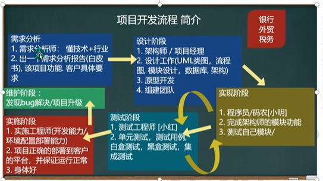

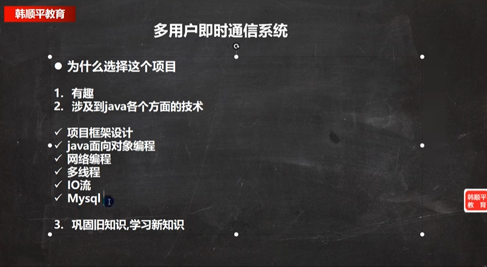
项目涉及！

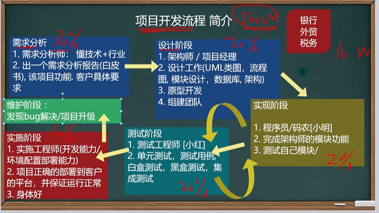
项目开发流程

## 需求

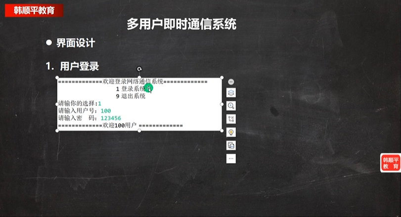

​						界面弱化用控制台演示界面

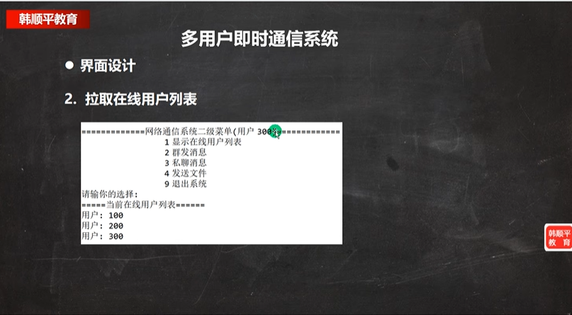

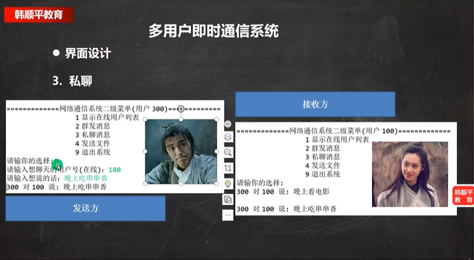

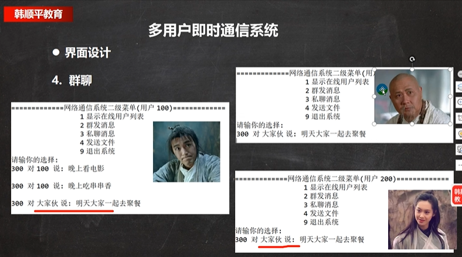

## 通讯系统整体分析

考虑到：

​	1、不是一个用户要发送消息，是多个用户

​	2、而且发送是的各种各样的消息。

信息种类比较多，所以我们使用对象的方式来处理

如果通讯的话如何 保证一对socket被一直占有呢？
在服务器端一旦获取到一个socket 就启动一个线程。
如果希望能够群发给所有的客户端，就需要得到所有线程里面的socket，所以就需要一个集合来管理
而一个客户端也有可能会多个连接，（比如一个传送文件、一个视频聊天）

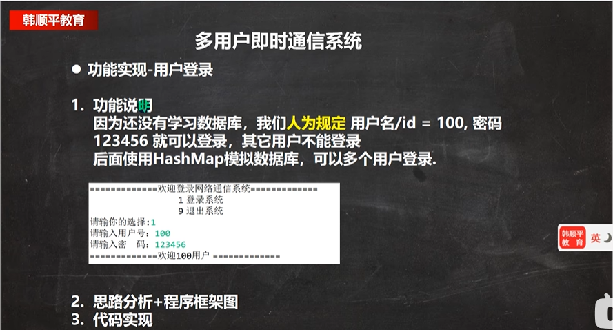

分析：Message 和User 对象是服务端 和 客户端 共享的。因为接收和发送嘛

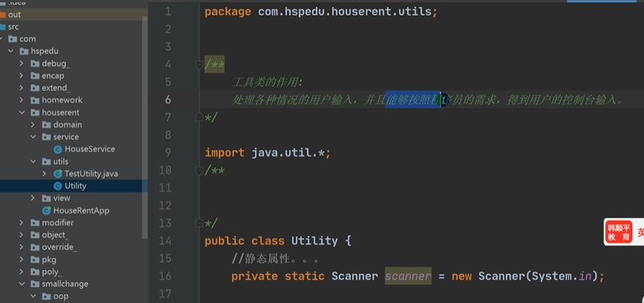
使用工具类

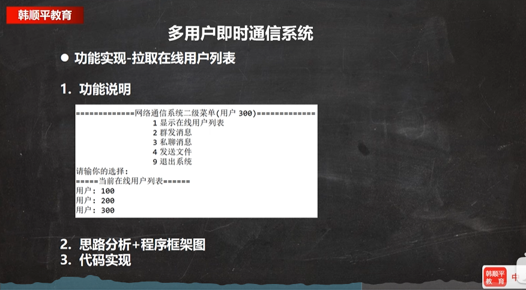

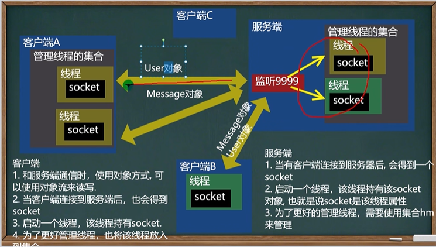
首先客户端给服务器发送一个user，服务器进行验证，返回一个Message对象，客户端查看是否成功

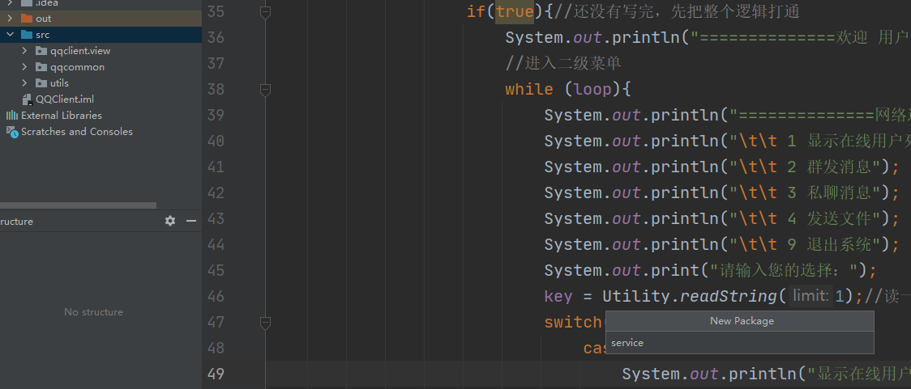
可能后面还会有其他的服务，所以创建一个包

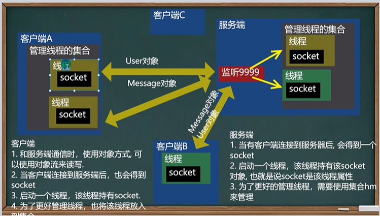
如果连接成功就应该启动一个线程，让这个线程维护或持有这个socket ,让线程一直可以和服务端保持通讯

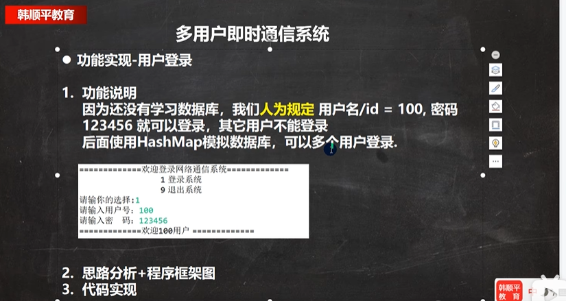

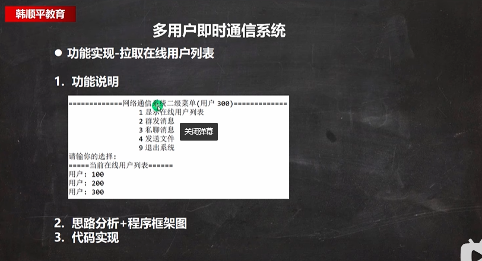

对消息类型进行扩展

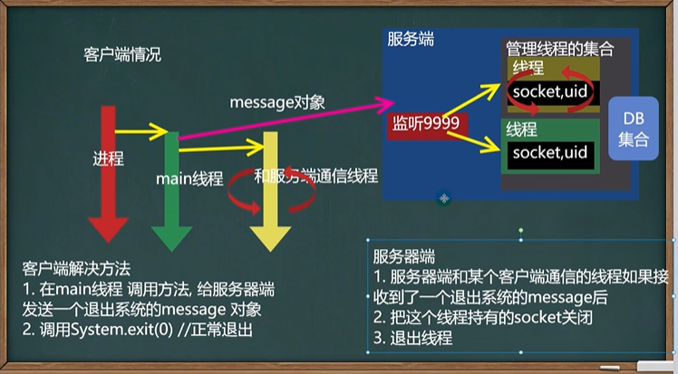

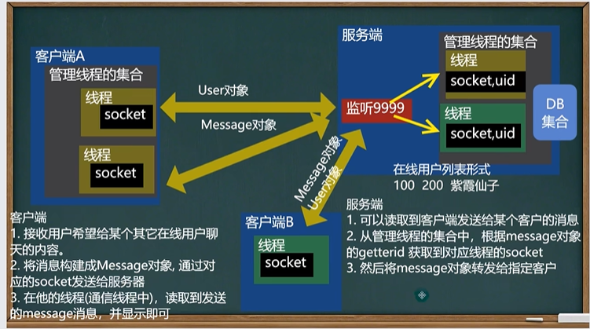

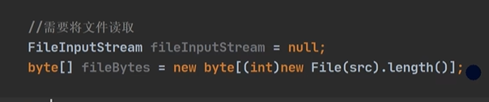
"学一手"

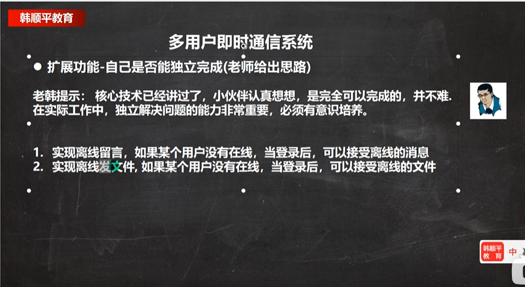