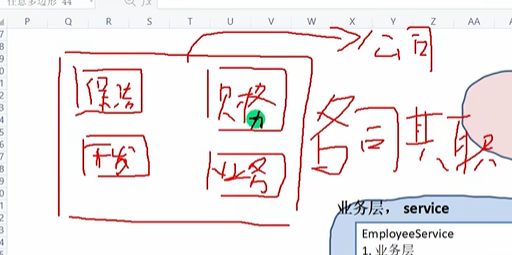
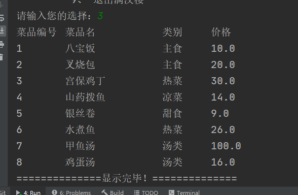
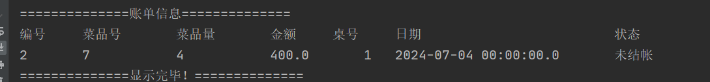

# 满汉楼项目

数据库和JDBC实战

## 界面

## 整体框架图

分层的作用也是各司其职！

这么多的东西都放一块，没有一个概念，没有一个管理的东西肯定就不好了。

## 准备工作

测试一下工具类好不好用

## 满汉楼菜单

## 登录

创建表

## 餐桌

## 订餐

## 满汉楼菜单

## 点餐

如果一个service里面需要另一个service的东西，就需要协同作战。

自己不做，只是通知别人去做，各司其职

## 帐单

## 结账

## 多表处理

为什么javabean与列名要对应
在底层是通过列名与它的setName来设置

所以如果要查找两个表，而这两个表中的字段有一样的，但表示不同含义，那么这就麻烦了
所以起个别句就好了。
