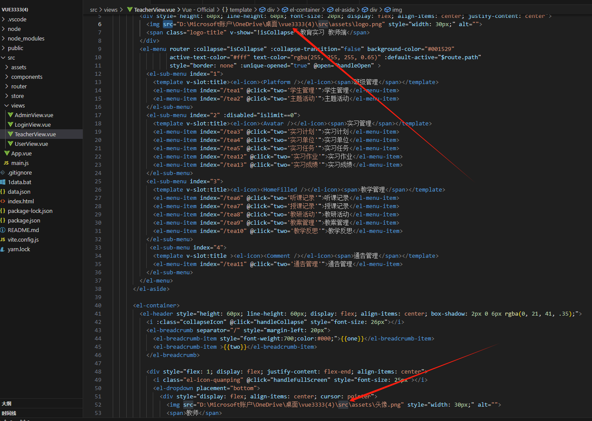
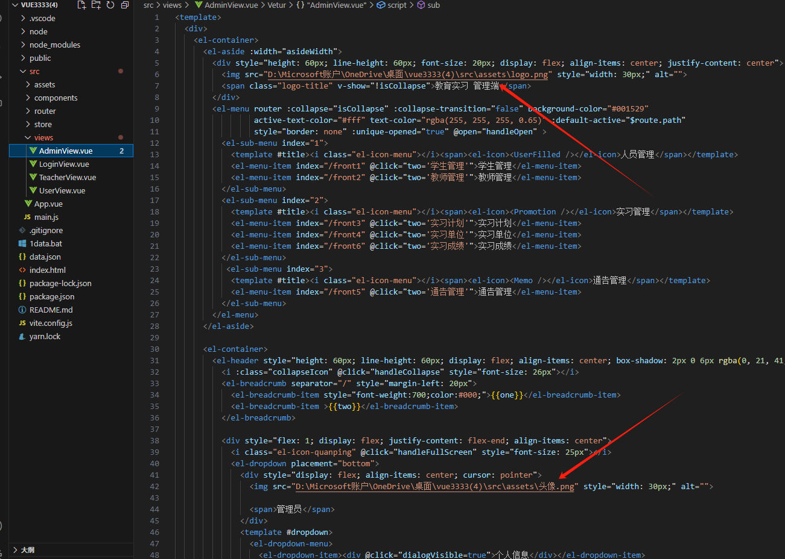
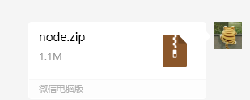

1、根据文档下载mysql 和 Navicat Premium 17 图形化界面。

2、导入db05数据库

```java
if(问题){
    问帅珂
}else{
    百度
}
```

3、下面四个地方改成绝对路径





4

这个是接口文件，用vscode打开。终端输入node ./index.js 运行接口

5、运行项目

第一次安装依赖：yarn

然后运行：yarn dev 