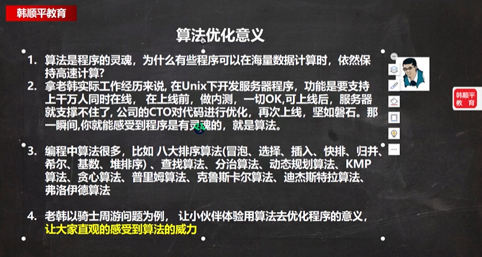
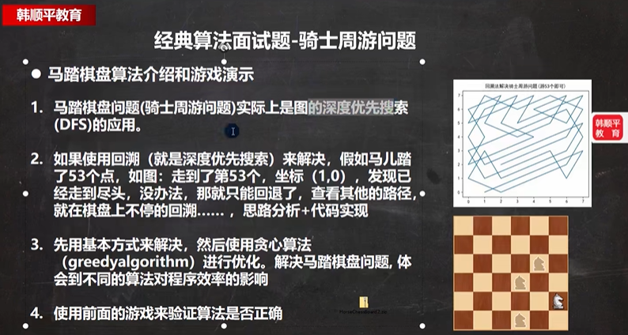
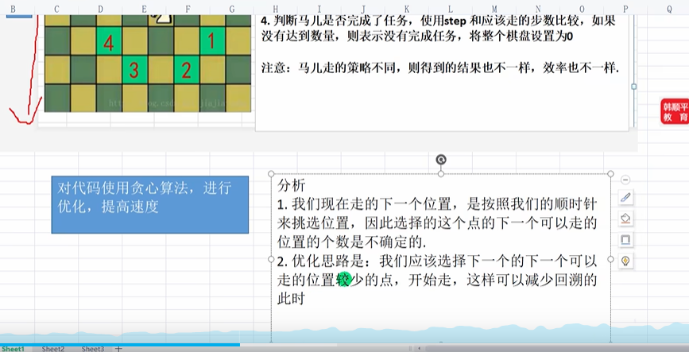

# 马踏棋盘









```java
package regexp;

import java.awt.*;
import java.util.ArrayList;
import java.util.Comparator;

/**
 * @author 王俊彪
 * @version 1.0
 */
public class HorseChessBoard {
    //定义属性
    private static int X=6;//col
    private static int Y =6;//row
    private static int[][]chessBoard = new int[Y][X];//棋盘
    private static boolean[] visited = new boolean[X*Y];//记录某个位置是否走过
    private static boolean finished = false; //记录马儿是否遍历完棋盘


    public static void main(String[] args) {
        int row =2;
        int col =2;
        long start = System.currentTimeMillis();
        traversalChessBoard(chessBoard,row-1,col-1,1);
        long end = System.currentTimeMillis();
        System.out.println("遍历耗时= "+ (end-start));
        //输出当前棋盘的状态
        for (int[] rows : chessBoard) {
            for (int step : rows) { //step表示该位置是马儿应该走的第几步
                System.out.print(step+"\t");

            }
            System.out.println();
        }
    }

    //写一个方法，对ps各个位置，可以走的下一个位置进行排序，把可能走的下一个位置从小到大排序
    public static void sort(ArrayList<Point> ps){
        ps.sort(new Comparator<Point>() {
            @Override
            public int compare(Point o1, Point o2) {
                return next(o1).size()-next(o2).size();
            }
        });
    }


    //编写最核心的算法，遍历棋盘，如果遍历成功就把finished 设置成true,并且把马儿走的每一步记录到chessBoard
    public static void traversalChessBoard(int [][] chessBoard,int row,int col,int step){


        //先把step 记录到chessBoard
        chessBoard[row][col]=step;
        //把这个位置，设置为已经访问
        visited[row *X + col] = true;
        //获取当前这个位置可以走的下一个位置有哪些
        ArrayList<Point> ps = next(new Point(col,row));
        sort(ps);
        //遍历
        while(!ps.isEmpty()){
            //退出一个位置（点）
            Point p = ps.remove(0);
            //判断该位置是否走过，如果没有走过，我们就递归遍历
            if(!visited[p.y*X + p.x]){
                //递归遍历
                traversalChessBoard(chessBoard,p.y,p.x,step+1);
            }
        }
        //当退出while，看看是否遍历成功，如果没有成功，就重置相应的值 ，然后进行回溯
        if(step<X*Y && !finished){
            //重置
            chessBoard[row][col]=0;
            visited[row * X +col]=false;
        }else {
            finished = true;
        }
    }


    //编写方法，获取当前位置，可以走的下一步的所有位置
    public static ArrayList<Point> next(Point curPoint){
        //创建一个ArrayList
        ArrayList<Point> ps = new ArrayList<>();
        //创建一个Point对象（点/位置）,准备放入到ps
        Point p1 = new Point();
        //判断是否可以走5位置
        if((p1.x = curPoint.x-2)>=0 && (p1.y = curPoint.y -1)>=0){
            ps.add(new Point(p1));
        }
        //判断是否可以走6位置
        if((p1.x = curPoint.x-1)>=0 && (p1.y = curPoint.y -2)>=0){
            ps.add(new Point(p1));
        }
        //判断是否可以走7位置
        if((p1.x = curPoint.x+1)<X && (p1.y = curPoint.y -2)>=0){
            ps.add(new Point(p1));
        }
        //判断是否可以走0位置
        if((p1.x = curPoint.x+2)<X && (p1.y = curPoint.y -1)>=0){
            ps.add(new Point(p1));
        }
        //判断是否可以走1位置
        if((p1.x = curPoint.x+2)<X && (p1.y = curPoint.y+1)<Y){
            ps.add(new Point(p1));
        }
        //判断是否可以走2位置
        if((p1.x = curPoint.x+1)<X && (p1.y = curPoint.y+2)<Y){
            ps.add(new Point(p1));
        }
        //判断是否可以走3位置
        if((p1.x = curPoint.x-1)>=0 && (p1.y = curPoint.y+2)<Y){
            ps.add(new Point(p1));
        }
        //判断是否可以走4位置
        if((p1.x = curPoint.x-2)>=0 && (p1.y = curPoint.y+1)<Y){
            ps.add(new Point(p1));
        }
        return ps;
    }
}
```